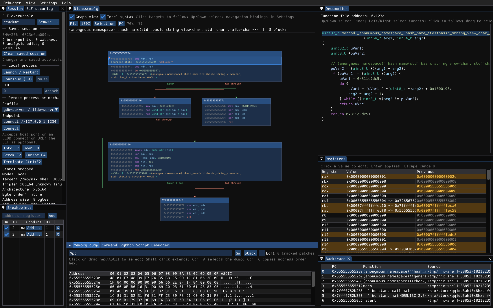
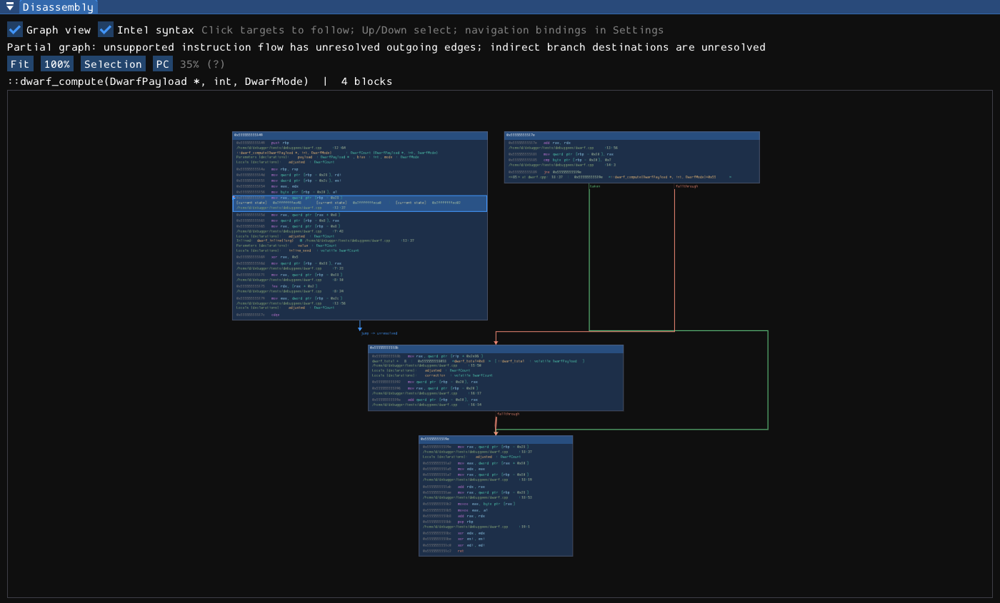
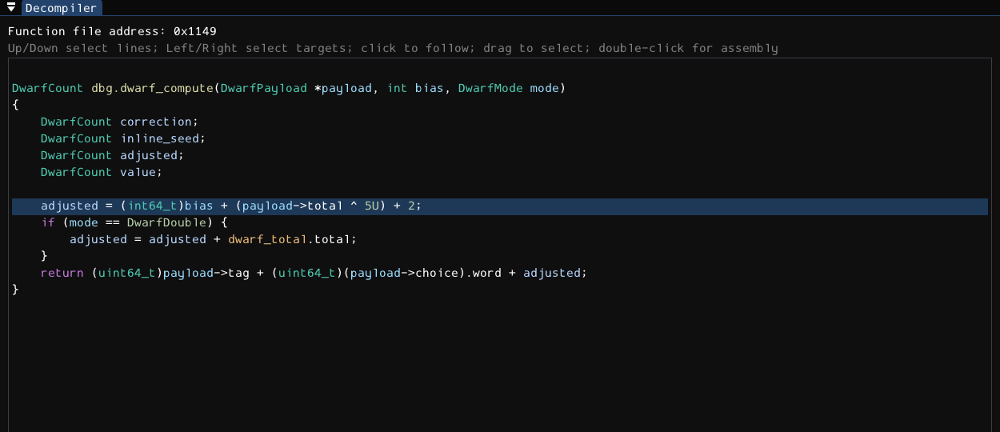
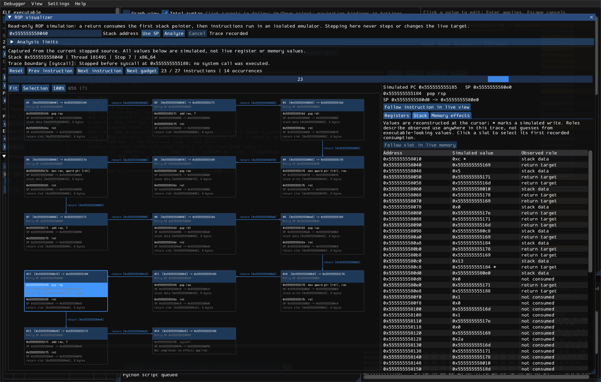
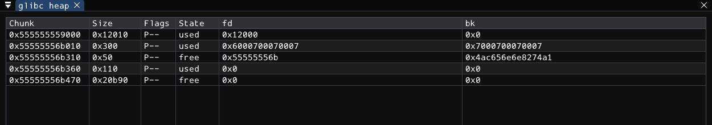
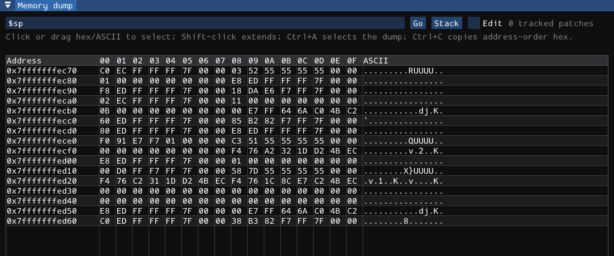
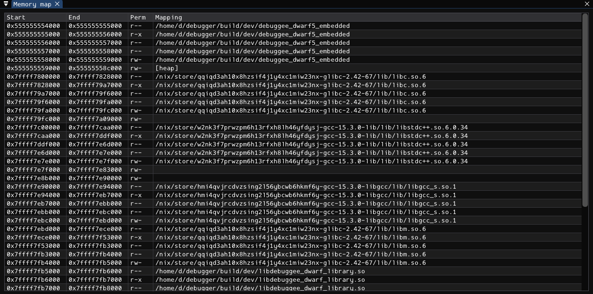
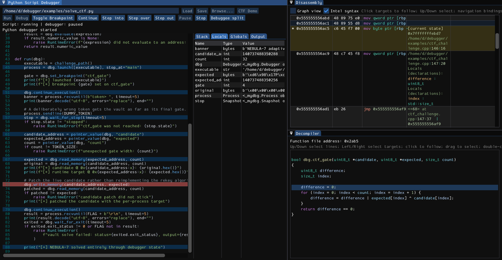

# mydbg

A Linux debugger for reverse engineering and exploit work.

LLDB control, rz-ghidra decompilation, graph disassembly, memory tools, heap inspection, Python automation, symbolic execution, and ROP review — in one workspace.

No tab-juggling between debugger, decompiler, memory viewer, scripts, and notes.

## Watch it

<video src="rop-review-demo.mp4" controls width="100%"></video>

[Open the ROP review demo](rop-review-demo.mp4)

[](docs/manual/screenshots/overview.png)

## Why it exists

Most debuggers are good at stopping a process.

Reverse engineering needs more:

- understand unfamiliar code
- follow pointers and stack state
- inspect heap chunks
- patch instructions
- decompile hot paths
- automate the boring parts
- test exploit ideas without losing context
- review ROP chains before running them

mydbg puts that loop in one native UI.

## Try it

```console
./scripts/build.sh
./build/dev/mydbg ./path/to/elf
```

The GUI stops new launches at `main`.

```console
F9       continue
F2       breakpoint
F7/F8    instruction step
F11/F10  source step
F1       manual
```

## Reverse faster

Disassembly, graph view, decompiler, registers, stack, memory, modules, maps, threads, and backtrace stay in sync.

| Graph | Decompiler |
| --- | --- |
| [](docs/manual/screenshots/graph.png) | [](docs/manual/screenshots/decompiler.png) |

What you get:

- linear and graph disassembly
- clickable calls, jumps, and pointers
- history for code navigation
- DWARF names, prototypes, records, and source context
- saved comments, symbols, watches, breakpoints, and decompiler edits

## Exploit workflow

Memory, heap, patching, scans, cyclic patterns, and ROP review are first-class panels.

| ROP review | Heap |
| --- | --- |
| [](docs/manual/screenshots/rop-visualizer.png) | [](docs/manual/screenshots/heap.png) |

| Memory | Patch / inspect |
| --- | --- |
| [](docs/manual/screenshots/memory.png) | [](docs/manual/screenshots/inspection.png) |

ROP review is stack-driven:

- start from a stack slot or `$sp`
- step instruction by instruction
- see return edges and stack pivots
- see register and memory effects in the graph
- sync Disassembly / Memory dump to the simulated cursor
- hover for full clipped text

The simulator uses captured target state. Reviewing a chain does not step the live process.

## Script everything

Run Python in the GUI or headless. Debug the script itself when automation gets complex.

[](docs/manual/screenshots/python-debug.png)

```console
./build/dev/mydbg --script ./script.py
./build/dev/mydbg --headless-script ./script.py
```

Examples ship with the repo:

```console
./build/dev/mydbg --headless-script examples/rop_crackme.py
./build/dev/mydbg --headless-script examples/solve_symbolic.py
./build/dev/mydbg --headless-script examples/rop_emporium/solve_ret2win_x64.py
```

## Local, remote, cross-arch

Use the same workspace for:

- local launch
- PID attach
- `lldb-server`
- `gdbserver`
- QEMU user-mode stubs
- QEMU system stubs

Pick the profile in **Session**, enter the stub endpoint, and provide the local ELF or symbols.

## What makes it different?

| Job | Built in |
| --- | --- |
| Debug process state | LLDB backend |
| Understand binaries | Rizin + rz-ghidra |
| See control flow | linear + graph disassembly |
| Navigate targets | calls, jumps, pointers, history |
| Inspect memory | hex, ASCII, typed values, scans |
| Exploit work | patches, heap, cyclic patterns, ROP review |
| Automate | embedded Python + headless scripts |
| Solve paths | optional angr backend |
| Build chains | optional angrop backend |
| Cross-arch debugging | QEMU GDB stubs |
| Keep work | SHA256-keyed sessions |

## Features

- LLDB-backed process control
- Rizin/rz-ghidra analysis and decompilation
- synchronized disassembly, registers, stack, memory, modules, maps, threads, backtrace
- conditional breakpoints
- instruction patching and Intel-syntax assembly
- string scans, typed value scans, pointer chains, telescope, cyclic patterns
- ELF security and glibc heap views
- Python automation and source-level Python debugger
- optional angr symbolic execution
- optional angrop ROP tooling
- stack-driven ROP visualizer
- native plugin API
- built-in manual, themes, keybindings, scaling, persistent layouts, localization catalogs

## Build

Linux only.

```console
./scripts/build.sh
ctest --preset dev
```

Output:

```text
build/dev/mydbg
```

NixOS:

```console
nix-shell
./scripts/build.sh
```

Use existing compatible Rizin/rz-ghidra builds:

```console
./scripts/build.sh --skip-deps
ctest --preset system-dev
```

Release:

```console
./scripts/bootstrap-analysis-deps.sh
cmake --preset release
cmake --build --preset release
```

## Requirements

Runtime/build basics:

- Linux
- C++20 compiler
- CMake 3.28+
- Ninja or Make
- pkg-config
- Python 3.12+ with embedding headers
- LLDB executable, headers, and library from the same install
- SDL3, OpenGL, libpng, bzip2
- Rizin `rz_core` 0.8.2 and matching rz-ghidra assets

Packages:

```console
# Arch
sudo pacman -S --needed base-devel cmake ninja git pkgconf python lldb sdl3 mesa libpng bzip2

# Debian/Ubuntu with SDL3
sudo apt install build-essential cmake ninja-build git pkg-config \
  python3 python3-dev python3-venv lldb liblldb-dev libsdl3-dev libgl-dev libpng-dev libbz2-dev
```

Full test runs also need `lldb-server`, Clang, LLD, and QEMU user emulators.

Python must match LLDB:

```console
lldb --print-script-interpreter-info
```

Override if needed:

```console
cmake -S . -B build -DPython_EXECUTABLE=/path/to/lldb-compatible-python
```

## Optional symbolic / ROP backends

```console
scripts/bootstrap-symbolic.sh
```

Installs angr, angrop, Unicorn, and Capstone into `.venv-symbolic`.

## Tests

```console
ctest --preset dev
```

Native-only loop:

```console
cmake --preset native-dev
cmake --build --preset native-dev
ctest --preset native-dev
```

Labels:

```console
ctest --preset dev -L unit
ctest --preset dev -L native
ctest --preset dev -L python
ctest --preset dev -L symbolic
```

## Repo map

```text
src/app/           GUI and panels
src/backend/lldb/  LLDB engine, commands, QEMU sessions
src/scripting/     Embedded Python and bindings
src/plugins/       Native plugin API
locales/en/        English UI strings
python/mydbg/      Python support package
docs/manual/       Built-in manual and screenshots
tests/             Tests, debuggees, scenarios
examples/          Example targets and scripts
```

## Manual

- [Getting started](docs/manual/01-getting-started.md)
- [Workspace and code analysis](docs/manual/02-workspace.md)
- [Execution and remote sessions](docs/manual/03-execution.md)
- [Breakpoints](docs/manual/04-breakpoints.md)
- [Memory and analysis](docs/manual/05-memory-and-analysis.md)
- [Command reference](docs/manual/06-command-reference.md)
- [Troubleshooting](docs/manual/07-troubleshooting.md)
- [Python automation](docs/manual/08-python-automation.md)
- [Settings and help](docs/manual/09-settings.md)
- [Plugins](docs/manual/10-plugins.md)
- [Symbolic execution and ROP](docs/manual/11-symbolic-execution.md)

Press `F1` in the GUI for the same manual.