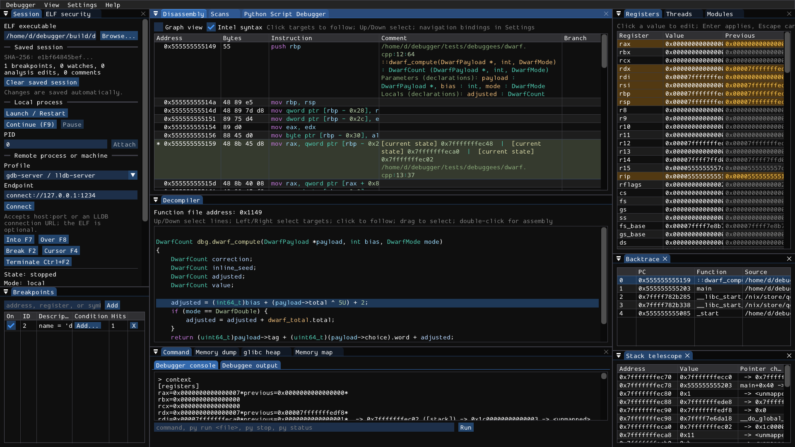
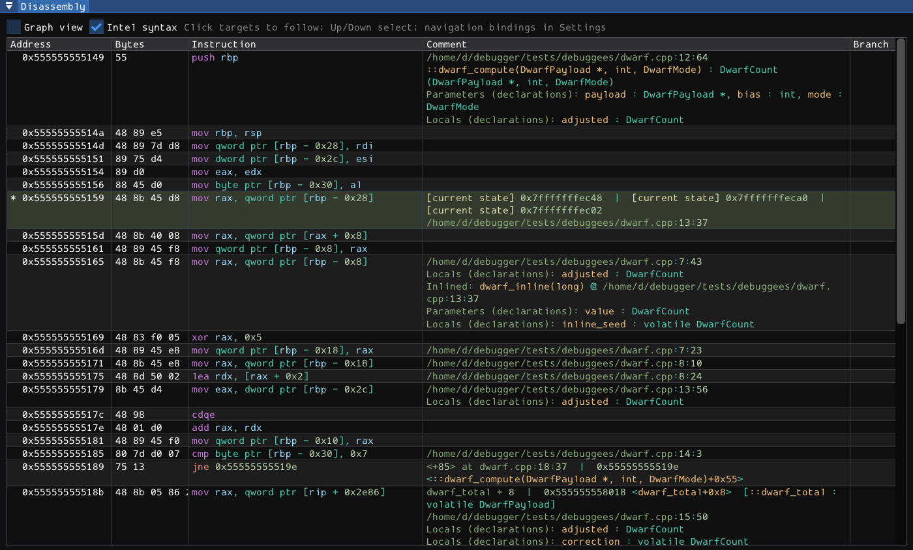
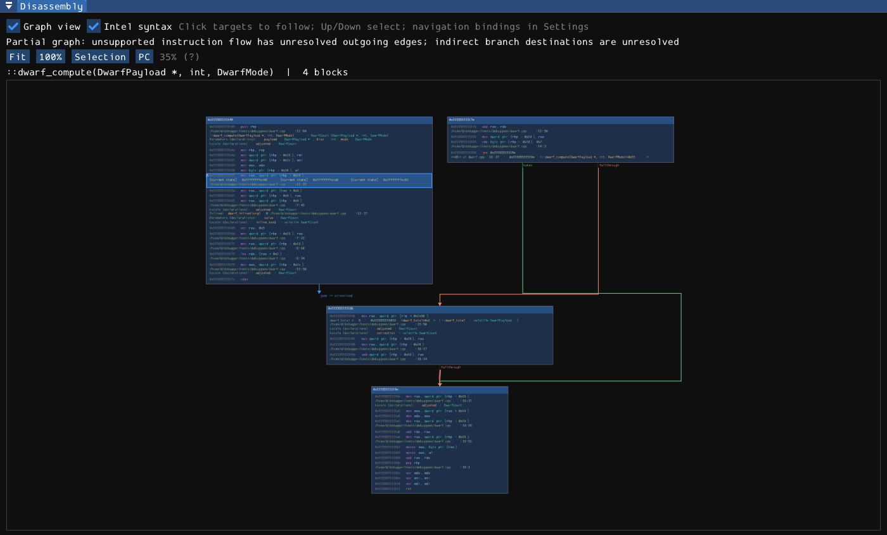
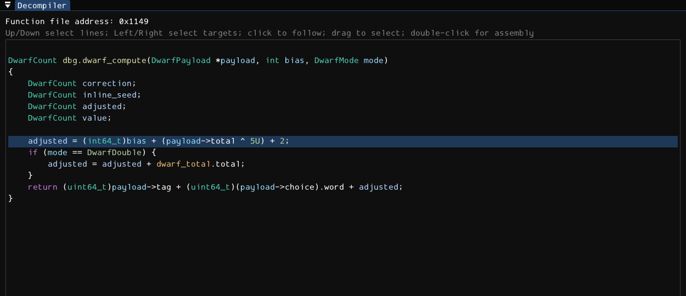
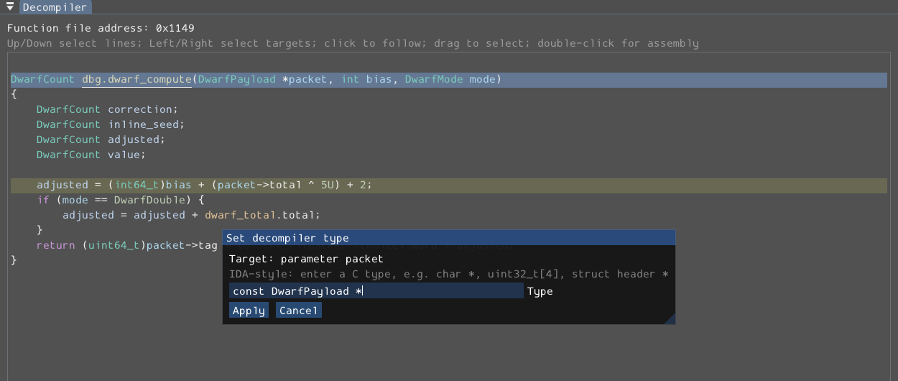
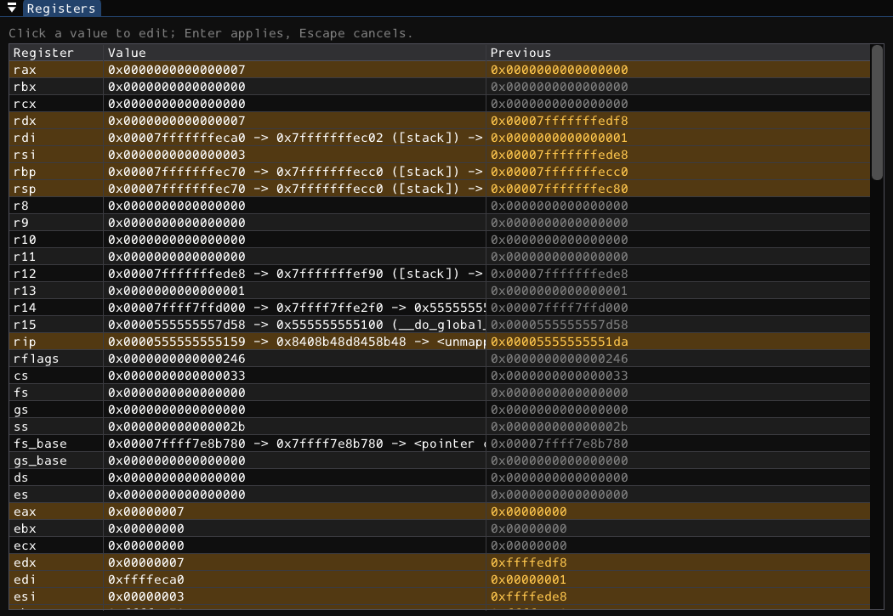
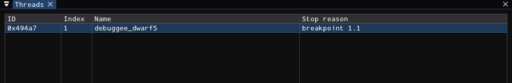
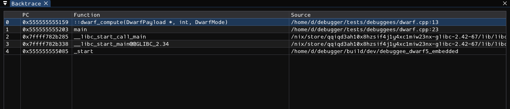

# Workspace and analysis

The workspace presents one debugger session through synchronized views. **Program counter**, **selected instruction**, and **selected frame** are different concepts: browsing code does not move execution; selecting a caller frame changes what its registers/variables mean; continuing runs the process, not the browsing cursor.

## Orientation

- **Session** owns target launch/attach/remote controls, state, stop reason, and saved-session status.
- **Breakpoints** lists native executable breakpoints and their bounded conditions.
- **Disassembly** shows LLDB instructions, bytes, live operand annotations, source/scope information, and an optional control-flow graph.
- **Decompiler** shows Ghidra-derived C-like code for the selected file-backed function, with editable names/types and address comments.
- **Registers**, **Threads**, and **Backtrace** inspect and select the stopped execution context.
- **Memory dump**, **Stack telescope**, **Memory map**, **Modules**, **ELF security**, **glibc heap**, and **Scans** are described in [memory and inspection](05-memory-and-analysis.md).
- **Command** separates debugger commands from the program's output. **Python Script Debugger** is a distinct source debugger for automation scripts, not an alternative view of the native stack.

Use **View** for optional panels. Drag tabs and dividers to arrange them; see [settings](09-settings.md) for layout persistence. A hidden panel does not stop the target or erase its data.

Most live operations require a stopped process. While running, a visible row may be the last captured snapshot, not continuously sampled data. Watch the Session state and stop revision rather than assuming a displayed register changed in real time. Python jobs also hold a control lease; its [pause and locking rules](08-python-automation.md) are separate from native stop state.

## Linear disassembly

The columns are **Address**, **Bytes**, **Instruction**, **Comment**, and **Branch**. Resize columns by dragging their boundaries. Long source/operand annotations can make a row taller; hover relevant text for its full detail. Current-PC and selected-row highlights are independent, and breakpoint markers indicate whether a breakpoint is enabled.

**Intel syntax** switches destination-first Intel versus AT&T formatting on supported x86 targets. Other architectures retain their native LLDB formatting and do not expose a meaningful Intel/AT&T toggle. **Graph view** changes presentation of the current function, not execution.

### Selecting and following

- Click an instruction to move the browsing cursor. Up/Down move through instructions while the panel has focus.
- Click recognized call, jump, symbol, or pointer targets to follow them. Executable destinations go to Disassembly; readable data destinations go to Memory dump. A number that cannot be resolved to navigable memory is not automatically a valid link.
- **Enter** follows the selected target. **G** opens an address/expression dialog. It uses the stopped target's address resolver, so registers and valid LLDB expressions can be used as well as numeric addresses.
- **Escape** goes Back; **Ctrl+Enter** goes Forward. Mouse Back/Forward buttons work too. The history records browsing destinations, not prior process states.
- **Space** toggles graph presentation. **Tab** switches between Disassembly and Decompiler while preserving code context.

Those navigation bindings are configurable. They do not fire during text entry or an unrelated modal dialog. Moving the cursor and following links never calls Continue by itself.

### Instruction context menu

Right-click the relevant instruction. Depending on target state and available metadata, the menu offers breakpoint set/remove or conditional editing, **Run to cursor**, memory/map navigation, an address comment, and instruction patching/assembly. **F2** toggles a native breakpoint at the cursor; **F4** runs to it. The latter resumes execution and can stop earlier for another breakpoint or signal.

Instruction patches change **live process memory**, not the ELF on disk. Assembly support is narrower than disassembly support. Read [patching](05-memory-and-analysis.md) before changing code.

### What annotations mean

Instruction syntax is colorized consistently in both linear and graph views. Annotations can include symbol names and offsets, string/pointer previews, DWARF source location and function signatures, parameter/local declarations, and current operand values.

A declaration is not proof that a variable has a live value at this PC. Optimized variables can be register-backed, stack-backed, constant, split into pieces, out of scope, or unavailable. The debugger uses the selected stopped context and available location information; it does not invent storage for an unavailable variable.

Branch insight is a prediction from captured registers/flags for the current stopped state. It is not a trace proving which branch will execute after memory/register edits, another thread's work, or later instructions. Inspect the explanation or unknown status rather than treating every graph edge as a known outcome.

## Control-flow graph

Enable **Graph view** in Disassembly or press Space with code focus. The graph groups instructions into basic blocks and labels taken, fallthrough, jump, loop, external, and unresolved edges where analysis can identify them. It reuses instruction syntax, source annotations, breakpoint indicators, and PC highlighting from the linear view.

Controls:

- Drag empty background with the left mouse button, or drag with the middle button, to pan.
- Use the wheel over the canvas to zoom around the pointer. Zoom is bounded to 10%-250%.
- **Fit** fits the available graph; on large functions this can make text small. Zoom back in to read individual instructions.
- **Reset zoom** returns to 100% without discarding the chosen center.
- **Selection** centers the browsing cursor; **PC** returns to the current program counter.
- Click a row to select it, a resolved operand to follow it, or a resolved edge/edge label to follow its destination. Hover rows/edges for details.
- Right-click an instruction for the same native debugger actions as the linear view. Up/Down and the shared navigation bindings work in the graph too.

A graph is bounded static analysis of the selected function, not a complete runtime call graph. An indirect or external edge may have no known destination. Missing basic blocks, a missing local image, or an unsupported analysis result is reported rather than replaced with fabricated edges. Stop or attach before using live navigation.

## Decompiler

Decompiler requests run separately from the GUI. **Loading**, an error, or an analysis notice is meaningful: wait for the requested function instead of editing stale text. Content is associated with the target generation, module, saved session, and analysis revision. A delayed result from a previous run must not be treated as the current function.

The header's function address is an **ELF file virtual address**, not the relocated process address. Disassembly uses load addresses. mydbg translates between them when the module and its load mapping are available. A file virtual address is also not a byte offset into the ELF file.

### Source navigation and copying

- Click code to select its mapped instruction or recognized target. Recognized calls/pointers can be followed into code or data.
- Up/Down select lines. Left/Right move between recognized targets on the line. Enter follows the selected target.
- Double-click a mapped code line, or use **Show disassembly**, to inspect the corresponding assembly.
- Drag across lines to select text; **Ctrl+C** or **Copy selected lines** copies the selected range.
- Back/Forward preserves useful code-location context, including the selected decompiler line/target where possible.
- The context menu also offers native breakpoint/condition actions, Run to cursor, Follow memory, Show memory map, and address comments when a valid address is available.

C-like output is reconstructed analysis, not the original source. There can be several instructions for a line, instructions without a clean C equivalent, and generated labels or temporary names. Do not assume source-level editing or recompilation from this view.

### Rename and type editing

Select the specific token first. Enabled actions depend on whether Ghidra identified a function, variable, argument, type, or address-backed object. Check the dialog's **Target** label, click the Name or Type input, then enter the replacement and apply it.

- **N / Rename** opens a name editor for a renamable token.
- **Y / Set type** opens a type editor.
- **P / Set pointer type** starts that editor with `void *`.
- **[ / Set byte-array type** starts with `uint8_t[16]`.
- **Shift+[ / Convert to struct pointer** starts with `struct type *`; replace the proposed name with a real type definition/name appropriate to the target.
- **A / Mark as string** marks a referenced file-backed address as string data.

The proposed type text is an editable starting value, not proof of the actual layout. Apply a compatible type and inspect the re-decompiled result. Invalid or unsupported edits report an error and are not added to the saved edit history. An edit that succeeds is replayed after the DWARF baseline on future matching sessions.

Names/types/string markings guide analysis; they do not rewrite machine code, resize allocations, or alter target data. A successful address-backed hint can also appear in Memory dump's **Typed decompiler view**. That small display has stricter layout limitations than DWARF/Ghidra's type system; see [memory](05-memory-and-analysis.md).

### DWARF inputs

The patched providers import available function prototypes, local/global names, enums, typedefs, and record layouts before user overrides. Supported inputs include embedded DWARF and matching separate/split debug information, including the repository's DWARF4/5 and `.dwo`/`.dwp` workflows. Keep corresponding debug files accessible and matched to the binary; missing or mismatched files cannot be inferred from an arbitrary source tree.

Location lists and scopes are PC-dependent. Optimization, unsupported DWARF operations, incomplete debug information, and Ghidra representation limits can reduce fidelity. The decompiler may normalize qualifiers or types instead of reproducing the exact source spelling. The absence of a local value is not necessarily a bug in register or memory reading.

For shared-library code, the local matching module image and correct load mapping matter as much as the main executable. Saved annotations are additionally keyed by that module's SHA256; replacing a library does not carry old address annotations onto different bytes.

## Registers

Registers shows current values and captured previous values, highlighting changes between stops. A frame selection can change the register context; it is not equivalent to reading every thread's registers simultaneously. Vector or architecture-specific registers may be represented as formatted text rather than a single integer.

Click a value to edit it or choose **Edit register value** in its context menu. Enter applies; Escape cancels. The target must be stopped and controls unlocked. Invalid values produce a visible error. Successful writes refresh the stopped snapshot; inspect the result before continuing. Changing PC, SP, flags, or calling-convention registers can radically change execution.

The context menu can follow a numeric pointer in Disassembly or Memory dump and locate it in Memory map. Unavailable or unmapped values are not navigable. Use [register commands](06-command-reference.md) or `dbg.read_register` for scripted access.

## Threads and backtrace

Open **View > Threads** to see the thread ID/index, name, and stop reason. Select a thread to change the inspected context. **Backtrace** lists frames for the selected thread, with PC, function, source, and selection state. Select a frame to inspect that frame's context; following its address is browsing, not unwinding execution.

Stack addresses, argument values, and registers can be unavailable for optimized or incompletely unwound frames. A source filename shown in the table is debug metadata; it does not imply an integrated source-file editor or that the source exists locally.

**Stack telescope** provides pointer-oriented stack inspection, separate from the symbolic backtrace. It and the module/map/security panels are covered in [inspection](05-memory-and-analysis.md).

## Stop intelligence and history

The native console's `context` command collects register deltas, nearby instructions, operand/ABI insight, stack, backtrace, threads, and crash information. Request individual sections with `ctx regs`, `ctx insight`, `ctx history`, or `ctx crash`; configure the default list with `set context-sections ...`.

Stop history describes captured stops. It is **not reverse debugging**: selecting or printing history does not restore old memory, registers, or instruction execution. Crash triage may identify fault context, executable-stack metadata, and cyclic-pattern matches, but is not proof of exploitability. Expression watches and execute-mode watches have different safety and persistence rules; consult the [command reference](06-command-reference.md).
