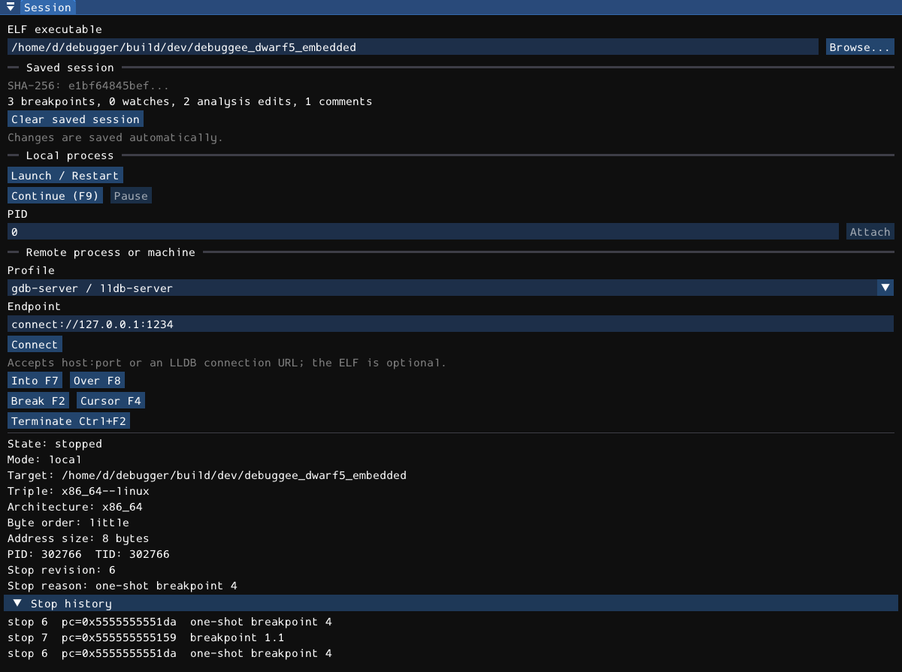

# Execution and remote

Use the Session state and stop reason to decide what an action will do. **Stopped** means the native target can be inspected. **Running**, **Launching**, and **Connecting** are different transitional states; visible code and registers can still be an older snapshot.



## Local launch and restart

In **Session**, enter an ELF path or use **Browse** to choose one. **Launch / Restart** starts a fresh local process and stops at main. Starting mydbg with one ELF argument does the same thing.

**Start / Continue (F9)** starts when there is no live process and continues an existing stopped process. It does not mean "always restart." Use Launch / Restart when you want another run of the program. **Debugger > Start at main** and **Start at entry** select the initial stop policy explicitly. A program without a resolvable main may need the entry policy.

A restart is a new process generation. User breakpoints and supported [saved annotations](04-breakpoints.md) survive; transient breakpoints, memory patches, scans, old output, and live execution state do not become the new process's state. Saved breakpoint IDs or relocated addresses need not remain identical.

### Arguments, working directory, and environment

There are no separate argument/environment fields in the Session panel. Use native commands or Python:

```text
file /absolute/path/to/program
set args first "argument with spaces"
argv
run
```

`file` loads without launching and refuses to replace a live process. `set args` replaces stored launch arguments; with no arguments it clears them. `argv` displays this configured launch list, not the inferior's argv array. A nonempty `run ...` replaces the list for that launch; plain `run` keeps the configured list. Native tokenization is not a shell and does not perform variable expansion, pipelines, or command substitution. Empty quoted arguments are not preserved by that tokenizer; use Python for an exact argv vector.

LLDB exposes working-directory and environment settings, for example:

```text
settings set target.launch-working-dir /absolute/path/to/work
settings set target.env-vars MODE=debug
```

Or use the exact Python launch contract:

```python
def run(dbg):
    process = dbg.launch(
        ["/absolute/path/to/program", "first", "argument with spaces", ""],
        stop_at="main",
        environment={"MODE": "debug"},
        cwd="/absolute/path/to/work",
    )
```

Successful launch arguments and working directory can be saved with the executable session and reused by later ordinary GUI launches. Explicitly supplied launch options take precedence; an explicit empty argv tail can clear saved arguments. Environment overrides are not automatically replayed from saved sessions. Python `restart()` can reuse that Debugger object's earlier launch options, including its environment; that is different from persistence across application runs.

Changing the text in the GUI executable field does not itself launch or replace a target. The actual target path is reported in Session metadata. A script can load a target independently of this input field; check the reported target rather than assuming the field is authoritative.

## Pause, terminate, and detach

- **Pause (F12)** requests a stop of a running native process. Wait for the stopped snapshot before editing state.
- **Terminate (Ctrl+F2)** kills the current debuggee. It does not exit mydbg. Use it deliberately, especially after PID attach.
- To leave an attached process without killing it, use the LLDB `process detach` command or Python `dbg.detach()`.

Do not equate "cancel a Python script" with "terminate the target." The script may have left a process running or stopped; inspect Session afterward.

On attach/remote sessions, stopping, detaching, killing, and disconnecting are protocol/target operations with potentially different effects. Do not close a window as a substitute for a deliberate detach decision when the process matters.

## Instruction and source stepping

Native default bindings:

- **F9**: Start / Continue.
- **F12**: Pause.
- **Ctrl+F2**: Terminate.
- **F2**: Toggle breakpoint at the selected instruction.
- **F4**: Run to cursor.
- **F7**: Step into one instruction.
- **F8**: Step over one instruction/call.
- **F11**: Source step into.
- **F10**: Source step over.
- **Shift+F11**: Finish current function.
- **Shift+F7**: Run until next call.
- **Ctrl+F7**: Run until next branch.
- **Shift+F8**: Run until next return.
- **Ctrl+F8**: Run until next system-call instruction.

Start-at-main and start-at-entry have menu entries but no factory keybinding. All listed native actions can be rebound in [Settings > Keybindings](09-settings.md).

Instruction stepping is useful without source information. Source stepping follows LLDB's source-line plans and depends on usable debug information; optimized/inlined code can produce surprising apparent jumps. Finish uses the selected thread's step-out plan, not a rewind to the caller's previous state.

Click the native code view before using native bindings. When the Python Script Debugger has focus, shared keys operate on **Python source** instead. Text input and dialogs can consume keys.

## Run to cursor and run-until

Select an instruction, then press F4 or choose Run to cursor. mydbg asks LLDB to run the selected thread to the destination. This resumes the process; another breakpoint, signal, exit, or target error can stop it first. Inspect the resulting stop reason rather than assuming the requested address was reached.

The **Debugger > Run until** actions are bounded **linear-disassembly lookahead**, not a dynamic tracing loop:

1. Read the next instructions from the current PC.
2. Skip the current instruction.
3. Choose the first matching mnemonic in that linear list.
4. Run to that address.

Calls, branches, returns, and syscall-like instructions use architecture-aware mnemonic heuristics. An instruction may be on a path execution never takes. The branch matcher is broad, not a complete semantic decoder. No match produces an error rather than unbounded searching.

The console forms include:

```text
nextcall
nextbranch
nextret
nextsyscall
xuntil cmp 512
```

The fixed actions look ahead 256 instructions. `xuntil MNEMONIC [MAX]` uses a case-insensitive mnemonic substring and clamps MAX to 1-4096. The count is an analysis bound, **not a time limit on target execution**. Use Pause if a target continues without reaching the selected destination. `nextproginstr` simply selects the next linearly decoded instruction; it is not a filter that skips library code.

## Attach to a local process

1. Enter the executable/symbol path when available.
2. Enter the numeric PID in Session.
3. Click **Attach** and wait for a stopped state.
4. Inspect the reported target, PID, architecture, and stop reason before continuing.

Attach does not restart the process or retroactively capture its earlier output. Linux ptrace permissions, user IDs, security policy, containers/namespaces, and another debugger can prevent attach. Prefer launching an owned child process for reproducible debugging; do not disable system-wide ptrace protections as a routine workaround.

The native `attachp PID` compatibility command requires a selected target. Raw LLDB `process attach ...` and Python `dbg.attach(PID)` are also available. Use the API appropriate to your setup rather than assuming all attach entry points have identical arguments.

## Remote GDB-protocol sessions

Session has three profiles: **gdb-server / lldb-server**, **QEMU user**, and **QEMU system**. The profile controls mydbg's interpretation and available local-process fallbacks; it does not launch the remote server for you.

1. Start the matching stub yourself and arrange a protected connection.
2. Select a matching local ELF/symbol image when available.
3. Choose the profile.
4. Enter `host:port` or an LLDB connection URL such as `connect://127.0.0.1:1234`.
5. Click **Connect** and wait for stopped target metadata.

For an ordinary local stub, representative server commands are:

```sh
lldb-server gdbserver 127.0.0.1:1234 /absolute/path/to/program
# Alternative, when supported by the target/toolchain:
gdbserver 127.0.0.1:1234 /absolute/path/to/program
```

Check the installed server's CLI for attach and platform-server variants; mydbg connects to a GDB-remote endpoint, not an arbitrary LLDB platform service.

GDB-remote stubs generally do not provide authentication or encryption. Bind to loopback or use a secure tunnel; do not expose a debug stub to an untrusted network. Anyone with access can potentially inspect or control the target.

### QEMU user mode

Start the foreign executable under the appropriate user emulator:

```sh
qemu-aarch64 -g 1234 /path/to/aarch64-program
```

Choose **QEMU user**, provide that ELF locally, and connect to `127.0.0.1:1234`. A dynamically linked program may also need an appropriate QEMU sysroot (`-L`) or environment. The executable, libraries, symbols, and emulated ABI must agree.

Target pointers and memory encodings follow the target's width/byte order, not the host's. x86 Intel/AT&T settings do not apply to ARM/MIPS/PPC. Remote register/expression support varies by LLDB and stub; source-level C expression evaluation is not guaranteed merely because register packets and instruction stepping work.

### QEMU system mode

Configure the desired machine/kernel/image yourself and add:

```sh
qemu-system-aarch64 [machine-and-image-options] -S -gdb tcp::1234
```

The bracketed text denotes options you must supply, not a literal runnable machine configuration. `-S` holds the virtual CPU before execution; `-gdb` exposes the stub. Choose **QEMU system** and a relevant local ELF symbol image in mydbg.

This is a remote machine-debugging connection, not an OS-aware kernel debugger. Host `/proc` information, ordinary local PID semantics, complete guest memory maps, glibc process-heap analysis, and kernel security helpers may be unavailable or inappropriate. `kbase` and `kchecksec` explicitly report unsupported kernel functionality.

### Local symbols and memory maps

Remote execution can work with incomplete local metadata, but decompilation, file-backed annotations, source information, and binary-string extraction require matching local files. Using a different build can produce plausible but wrong names/addresses; SHA256-keyed authored state prevents replay onto changed local bytes, not mismatched remote code supplied by the user.

If a QEMU stub supplies no memory regions, mydbg can derive fallback regions from loaded ELF PT_LOAD segments. That does not discover anonymous heaps, all stacks, or arbitrary guest mappings. Navigation and scans can therefore be incomplete even when memory reads at known addresses work.

GUI Launch / Restart is a **local launch action**, not a restart command for a remote stub. Python restart is restricted to local sessions. Recreate or reconnect the remote process according to the server/emulator's lifecycle.

## Native and Python control ownership

A running or paused automation job retains a control lease. Most Session/menu/edit/inspection controls are disabled to avoid racing the script. The script's own Debugger methods remain available to it.

While Python is paused, code browsing and selected native debugging shortcuts are intentionally usable; this does not release the lease or turn all panels into editable live controls. Native Pause/Terminate are escape controls. Breakpoint/plugin paths are not a security boundary. Any native change can invalidate a paused script's assumptions, so inspect state before continuing the script.

A Python pause means "paused at a Python line," not "the native process is stopped." A script can pause immediately after launching or continuing the debuggee. Check both state indicators. [Python automation](08-python-automation.md) explains stepping, cancellation, waits, and output buffering.
