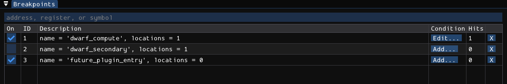
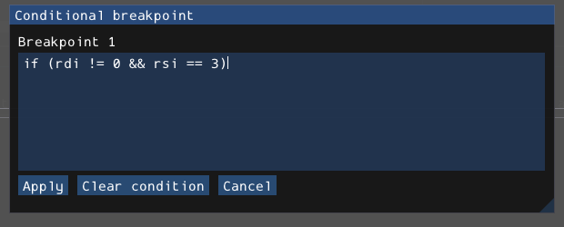
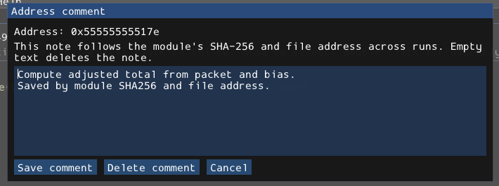

# Breakpoints and state

A native breakpoint stops the executable. A Python script breakpoint stops an automation source line. An expression watch displays a value; a hardware watchpoint stops on a memory access. These are separate features with different lifetime and safety rules.



## Creating native breakpoints

Enter a specification in **Breakpoints**, then press Enter or **Add**:

```text
dwarf_compute
0x555555555159
*($pc + 4)
$pc
```

A numeric address uses the current load address. `*EXPRESSION` resolves an address in the stopped frame; a recognized register name can also supply an address. Otherwise the helper treats the text as a symbol name. A symbol breakpoint can have multiple locations or remain **pending** with zero locations until its module appears. A created row does not by itself prove that execution can hit it.

In Disassembly or Decompiler, **F2** toggles a breakpoint at the selected mapped instruction. Right-click code to set/remove a breakpoint or open its conditional editor. In the Breakpoints table:

- The enabled checkbox enables/disables the breakpoint without deleting it.
- ID identifies the native breakpoint in this run.
- Description identifies its resolver/locations; hover truncated text for details.
- **Add... / Edit...** opens the bounded-condition editor.
- Hits reports the native hit count.
- **X** removes the breakpoint.

Use LLDB's explicit syntax for source-line, regular-expression, exception, or more advanced resolvers. The simple input helper does not specially interpret `file.cpp:42`:

```text
breakpoint set --file dwarf.cpp --line 13
breakpoint set --func-regex dwarf_.*
breakpoint set -E c++ -h false -w true
```

The last command catches C++ throws, not catches. Resolver availability is LLDB/target dependent. Console compatibility aliases such as `hbreak` and `thbreak` use the ordinary breakpoint helper; their names do **not** promise hardware or temporary behavior. `tbreak NAME` explicitly asks LLDB for a one-shot symbol breakpoint.

## Two kinds of native breakpoint condition

### LLDB conditions

LLDB evaluates its own expression language in the stopped frame. Use explicit quoting for a condition containing spaces:

```text
breakpoint modify --condition 'bias == 3' 2
breakpoint modify --ignore-count 4 2
```

Replace 2 with the actual breakpoint ID. The `condition ID TEXT` compatibility alias inserts TEXT into an LLDB command; it is not a safer parser. Explicit `breakpoint modify` is clearer when quoting or options matter.

LLDB expressions can execute target code or have side effects. They are distinct from the bounded, read-only language below. Ignore count is a breakpoint option, not a Python line-breakpoint feature.

### Bounded conditions

Use the table's Add/Edit condition button or **Set conditional breakpoint** on code. Type an expression, then **Apply**. Compilation errors are shown without replacing the previous valid condition. **Clear condition** removes it; **Cancel** discards the editor change. **Help > Conditional breakpoints** opens this chapter.



A console equivalent is:

```text
script-condition 2 if (rdi != 0 && rsi == 3)
```

This example is x86-64 calling-convention-specific. Use actual target register names and the actual ID. The UI's Clear control is the supported way to clear through the editor; do not assume `script-condition 2` is accepted as a console clear command.

## Complete bounded-condition language

The language reads registers and a bounded amount of memory. It cannot call arbitrary functions, write registers/memory, run Python, assign variables, execute a body, or evaluate general LLDB/C expressions.

### Values and operators

- Unsigned 64-bit decimal or `0x` hexadecimal integers.
- Register identifiers such as `rax`, `rdi`, `sp`, or `$pc`, subject to the target's actual registers.
- `true` and `false`.
- Numeric truthiness: zero is false, nonzero true.
- Numeric comparisons: `==`, `===`, `!=`, `<`, `<=`, `>`, `>=`.
- Boolean `!`, `&&`, and `||`, plus parentheses.
- An optional outer `if (...)` wrapper. There is no body and no trailing semicolon.

Negation binds before conjunction, which binds before disjunction. Numeric comparisons use **unsigned** values. `===` is accepted as equality; it is not JavaScript type-sensitive equality. There are no signed literals, addition/subtraction, indexing, general pointer dereference, or named source-variable lookup. Calculate an address elsewhere if it requires arithmetic.

```text
if (rax == 0)
(pc != 0 && sp != 0) || rax == 7
!(rsi < 3)
```

### Masked memory comparison

```text
masked_cmp(valueAt(rdi), "48 8? ??")
masked_cmp(valueAt(0x401000), "DEAD????")
```

The address is a register or numeric literal. `valueAt` is only an address marker inside the supported memory functions, not a standalone numeric load.

Whitespace is removed from the pattern. Every hex nibble is a digit or `?`; `?` ignores that nibble. The pattern must be nonempty, have an even nibble count, and contain at most 256 bytes. Even wildcard bytes must be readable because the implementation reads the complete pattern length.

### Exact NUL-terminated string comparison

```text
strcmp(valueAt(rdi), "token")
strcmp(valueAt(rdi) == "token")
```

Both accepted forms return a **Boolean match**, unlike C strcmp's signed ordering result. They require the literal bytes followed by a NUL. A readable prefix of a longer string is not an exact match.

String literals use double quotes and support `\n`, `\r`, `\t`, `\\`, and `\"`. They do not accept arbitrary `\xNN` escapes or single-quoted strings. These comparisons operate on bytes; they do not perform case folding or Unicode normalization.

### Limits and stop behavior

A condition is limited to 4096 source bytes and 64 levels of nested parentheses/unary expressions. `&&` and `||` short-circuit, so a guard can prevent a later memory read:

```text
if (rdi != 0 && strcmp(valueAt(rdi), "token"))
```

Conditions evaluate against the breakpoint thread's frame-zero registers and memory. A true result keeps the target stopped. A false result can allow automatic continuation, but another encountered breakpoint without a bounded condition, another matching condition, or another stop reason can still require attention.

Unknown registers, unreadable memory, and evaluation errors **keep the target stopped** and report the error. They are not silently treated as false. This fail-closed behavior is useful while iterating on a predicate.

## Watchpoints and expression watches

Hardware watchpoints use LLDB and depend on target/stub resources:

```text
watch expression
rwatch expression
awatch expression
```

These request write, read, or read/write watchpoints respectively. Use a real LLDB expression identifying the watched memory; inspect LLDB's resulting size/location and hardware-limit errors.

Expression watches instead add entries to the context display:

```text
ctx-watch eval payload->total
ctx-watch
ctx expressions
ctx-watch delete 0
```

Indices are zero-based and change after deletion. `display EXPR` adds to that same watch list; `undisplay INDEX` removes from it. `ctx-watch execute LLDB-COMMAND` is also available, but executes a command when watches refresh. Neither an LLDB eval watch nor an execute watch is the bounded condition language. Treat side effects deliberately.

Hardware watchpoints and execute-mode watches are not restored from saved sessions. Supported expression-watch definitions are restored, not their previous displayed values.

## Automatic saved sessions

The session identity is the **SHA256 of the complete local executable bytes**. It is not the path, filename, timestamp, or ELF build ID.

- Reopening the same bytes, including from a different path, selects the same session.
- Changing the bytes at the same path selects another session, even if its build ID was retained.
- File-backed breakpoint/annotation addresses also identify the relevant module by SHA256 and ELF file virtual address. They are relocated into the current process rather than replaying old ASLR load addresses.
- Replacing a shared library does not apply that library's old address annotations to its new bytes.
- A remote session needs a usable local executable/module image for this identity and file-backed restoration. Remote runtime bytes are not automatically proved equal to the user-supplied local file.

### What is remembered

Supported authored state includes:

- User breakpoint resolvers and supported options, enabled state, configured ignore count, native conditions, and bounded condition source.
- Pending symbolic breakpoints, including resolvers with no current locations.
- Standard console language-exception breakpoints such as C++ throw/catch resolvers.
- Expression-watch definitions and file-backed custom symbol annotations.
- Successful launch arguments and working directory.
- Successful decompiler rename, type, and string-marking edits, replayed in order after the DWARF baseline.
- Multiline UTF-8 address comments.

Successful edits are saved automatically; there is no separate Save session button. Session displays the short hash, full hash on hover, saved counts, autosave status, and storage/replay errors. Inspect errors: a visible edit does not guarantee it was persisted if the storage operation failed.

### What is intentionally not replayed

A saved session is **not a process checkpoint**. It does not restore memory, registers, patches, process/thread IDs, hit history, output, scan candidates, execution history, navigation, or a running process.

Temporary/internal/one-shot breakpoints, volatile thread restrictions, hardware watchpoints, runtime-only addresses without file backing, breakpoint callback/command/Python execution, scripted resolvers, execute-mode watches, and launch environment are not replayed. Unsupported opaque/script-created exception resolvers and native per-location overrides can produce notices rather than a false promise of full restoration.

Raw LLDB scripts that create and immediately run a target are reconciled after the LLDB interpreter returns. Do not assume mydbg can restore state in the middle of that opaque script. Prefer explicit load/launch commands or the public Debugger API when ordering matters.

## Address comments



Right-click a mapped instruction or a decompiler line/target and choose **Edit address comment**. Enter one or more lines, then **Save comment**. Empty text or **Delete comment** removes the note; Cancel leaves the current value unchanged.

Comments are anchored to a module/file address, not a transient row number. They appear in linear disassembly, graph annotations, and the mapped decompiler output. Ghidra may associate several instructions with one C-like statement; a comment is not a source-file line comment or an edit of the original source.

The per-comment limit is 64 KiB of UTF-8 text. Unknown/unbacked addresses cannot receive durable comments. Wait for a save to finish and inspect any error before navigating away from an editor.

## Clear saved session

Click **Session > Clear saved session** once. This is deliberately immediate, not a multi-dialog export/reset workflow.

Clearing removes supported saved and active authored breakpoint/watch/symbol/analysis/comment state for the selected executable session and rebuilds the unmodified DWARF analysis baseline. A new session epoch fences queued old edits so they cannot recreate the deleted annotations. It does not delete the executable, erase program memory, undo every arbitrary LLDB action, or reset global GUI preferences.

The button is disabled while running/connecting/launching, while a Python control lease is held, or while another clear is pending. Stop the process or finish/cancel the script first. An error is reported if the clear cannot be written.

Use clearing for a clean analysis start; use Launch / Restart for another run that retains your work. They solve different problems.

## Storage, limits, and privacy

The directory is selected in this order:

1. `MYDBG_SESSION_DIR`, if configured.
2. `$XDG_STATE_HOME/mydbg/sessions`.
3. `$HOME/.local/state/mydbg/sessions`.

Use an absolute valid directory. Session files are private, versioned JSON, written atomically with synchronization and locking. Independent debugger/analysis/comment updates are merged under the store's rules; this is not a collaborative live session UI. Multiple instances do not promise immediate live synchronization of every edit.

A session document is bounded to 16 MiB, with additional count/depth/string limits. Corrupt, unsupported-version, or unsafe files produce a visible error rather than silently being overwritten. Explicit clearing is the recovery path when you intend to discard invalid saved state.

The files can contain sensitive paths, launch arguments, symbol names, types, comments, and expressions. Do not place secrets in annotations or commit private session files to a repository accidentally. The GUI layout file is separate; see [global settings](09-settings.md).
