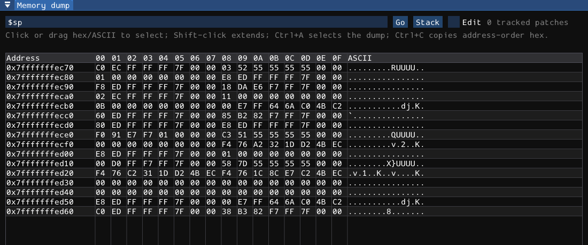
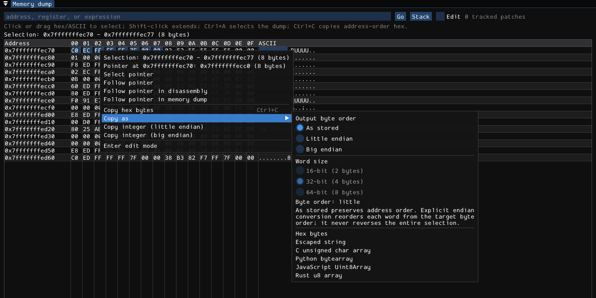
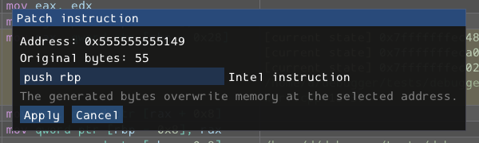
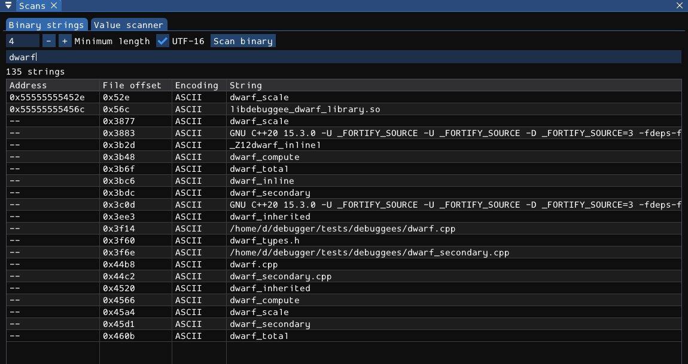
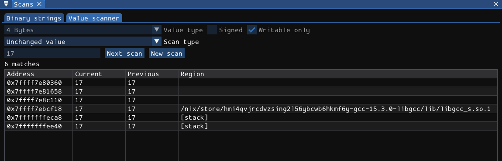
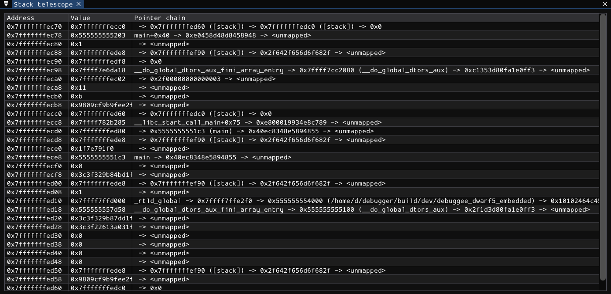
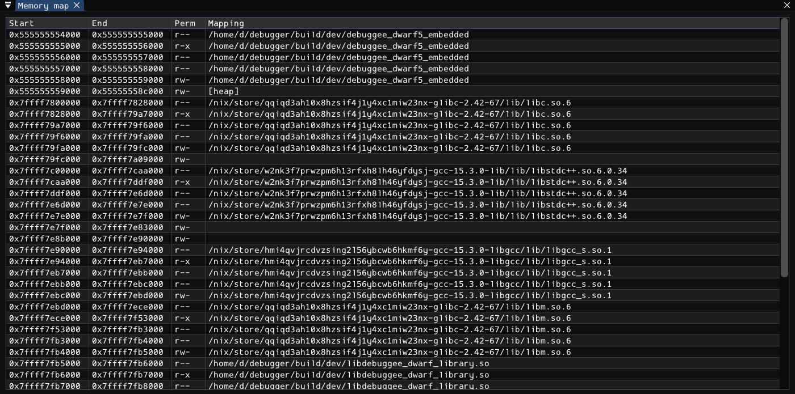
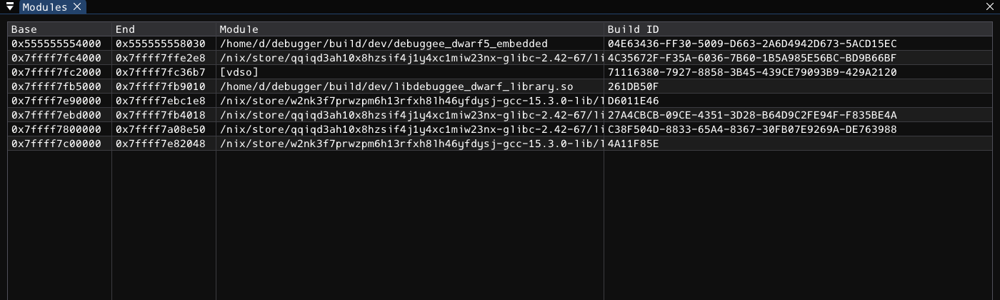
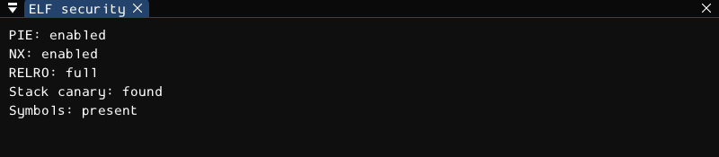
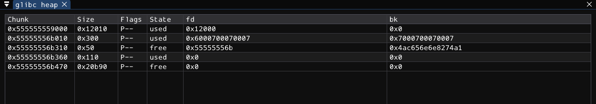

# Memory and inspection

Memory views inspect the current target's address width and byte order. They are not host-memory viewers. Stop the process before editing or using live navigation, and confirm the selected thread/frame when deriving addresses from registers or source expressions.

## Memory dump



Enter an address or valid stopped-frame address expression, then press Enter or **Go**. **Stack** follows the current SP. The native `dump ADDRESS` command selects the same view; `hexdump ADDRESS COUNT` instead prints a separate console result.

The dump captures up to **256 bytes**, in 16-byte rows. Address, hex bytes, and printable ASCII are shown together; nonprintable bytes appear as dots. An unreadable tail can produce a partial dump. There is no separate GUI page-size control: choose another base address to inspect the next region.

A chosen base is reused for later stopped captures until changed. A new process generation clears that runtime address. It is not a saved annotation that relocates automatically.

### Selecting bytes

Click a byte in either the hex or ASCII area. Drag for a contiguous range; Shift-click extends the selection from its anchor. Edge dragging can scroll the view. **Ctrl+A** selects the captured dump and **Ctrl+C** copies the selection as stored hex bytes when the window has focus and text entry/dialogs are not consuming input.

Right-click inside a selection to preserve it; right-click outside to start a selection at that byte. The view reports start/end/count. Changing process generation, dump base, or size invalidates the selection. A refresh that changes byte contents alone preserves the range, not an immutable copy of its previous bytes.

### Clipboard formats and byte order



**Copy hex bytes** uses uppercase pairs separated by spaces in memory order. **Copy as** offers:

- Hex bytes.
- A quoted escaped byte string, using `\xHH` escapes.
- A C `unsigned char data[]` initializer.
- A Python `bytearray` initializer.
- A JavaScript `Uint8Array` initializer.
- A Rust `[u8; N]` initializer.

For Copy as, choose **As stored**, **Little endian**, or **Big endian**. Explicit conversion also requires a 16-, 32-, or 64-bit word width. Conversion changes byte order **within each word**, not across the entire selection. The selection must contain complete words and the target byte order must be known. As stored needs no word conversion.

The dedicated **Copy integer LE/BE** actions accept one through eight bytes and interpret the whole selected integer in the specified byte order, returning a width-preserving hexadecimal value. They do not depend on the target's order. Every copy action is read-only; exporting big-endian bytes does not rewrite little-endian target memory.

### Following a pointer

The selection menu interprets a pointer starting at the **first selected byte**, not an arbitrary integer made from the entire range. It needs a complete 4- or 8-byte target pointer and known little/big endianness.

- **Select pointer** selects exactly the pointer-width bytes when enough data exists.
- **Follow pointer** chooses code or memory according to the destination mapping.
- Explicit **Follow pointer in disassembly** and **Follow pointer in memory** let you choose the view.

A null, unmapped, truncated, or otherwise unavailable destination may disable navigation. It is not made valid by changing the clipboard word size. Right-click a row address for row-level breakpoint/conditional actions, **Use dump address**, and **Show memory map**; that is a different menu from the selected-byte export menu.

### Editing bytes

Enable **Edit**, choose the context-menu edit action, or double-click a hex byte. Enter two hex digits in the cell. Enter or leaving an edited cell commits a changed valid byte through the tracked patch path. Invalid input reports an error; Escape or clicking outside the memory table exits edit mode.

The target must be stopped, controls unlocked, and data available. This is cell editing, not a multi-byte paste/fill operation. Changed ranges are highlighted and active tracked patches are counted. Use the patch ledger below to inspect/revert writes.

## Instruction assembly and tracked patches



Right-click code for raw-byte patching or assembly. The editor identifies the address/current bytes and accepts either complete hex bytes or assembly text. Invalid text remains an error, not a silent no-op.

Console equivalents:

```text
patch ADDRESS 90 90
assemble ADDRESS mov eax, 1
patch_list
patch_revert ID
```

Replace ADDRESS and ID with actual values. These examples **write live memory**; use owned scratch data or a deliberately chosen instruction, not an arbitrary pointer.

- Raw patching requires a stopped valid process, a nonempty range, readable original bytes, and a successful write.
- Overlapping tracked writes merge transitively, preserving the earliest original bytes. Restoring all original bytes removes the corresponding ledger entry.
- `patch_revert` accepts an ID or numeric address matching an entry. It writes the recorded original bytes; verify success. It is not guaranteed transactional recovery from every partial lower-level write failure.
- Assembly uses the Rizin Intel-syntax x86 assembler for supported 32-/64-bit x86 targets. Being able to disassemble an architecture does not imply assembly support.
- Assembled length need not equal the old instruction length. There is no automatic safe padding or control-flow repair.
- `nop` and `syscall` write fixed instruction encodings for a limited set of architectures. The syscall command writes an instruction; it does not invoke one.
- Raw LLDB memory writes and the `eb/ew/ed/eq` aliases are not automatically entered in the tracked patch ledger.

The ledger is process-generation state. Restarting clears it, and ordinary memory patches do not modify or persist in the ELF file. Back up binaries before using any separate on-disk patching tools.

## Typed decompiler hints

Successful address-backed decompiler type/string edits can produce a collapsible **Typed decompiler view** when their start address falls inside the current dump.

String previews stop at NUL or their bounded preview length. Primitive values use target byte order and are displayed as raw unsigned/hex values; a displayed float-sized field is not a full formatted floating-point object viewer. Pointers use target width.

Inline struct hints support a deliberately small field parser: recognized fields and fixed arrays are laid out consecutively. It does **not** calculate arbitrary ABI padding/alignment, bitfields, nested C++ object layout, or all type-system features. A field beyond the available dump or wider than the small scalar display can be unavailable. Do not mistake this convenience view for Ghidra/DWARF's complete record layout.

## Binary string extraction

Open **View > Scans > Binary strings**.



1. Choose minimum length, default 4 and bounded to 1-4096.
2. Choose whether to include the supported UTF-16 form.
3. Click **Scan binary**.
4. Use the text filter to narrow retained results.

This scans the **local selected ELF file**, not live RAM, every loaded module, or remote guest memory. It can work with a loaded target before launching. The file must be a supported ELF image and is bounded to 512 MiB.

ASCII extraction accepts printable ASCII plus TAB, without requiring a terminating NUL. The UTF-16 option recognizes that same character subset paired with zero bytes in ELF byte order, at both alignment parities; it is not a general Unicode text decoder.

Results show an address when available, file offset, encoding, and text. A process load address is preferred; otherwise an ELF file virtual address or unavailable marker is shown. PT_LOAD mappings connect file offsets to virtual addresses. Only a result with a real load address can be followed into the stopped process.

Double-click a load-address result to open Memory dump. Right-click for pointer/navigation/map/breakpoint actions. The filter is a case-sensitive substring of the retained string text. At most 50,000 records are retained; total/truncation status can indicate more matches. A truncated result list is not evidence that the file contained no other strings.

## Typed value scanner

Open **Scans > Value scanner**.



### First scan

1. Stop the target where the value exists.
2. Select 1-, 2-, 4-, or 8-byte integer, float, or double.
3. For integer types choose signed/unsigned. Float types do not use the signed toggle.
4. Choose **Writable only** if appropriate; it is enabled by default.
5. Choose **Exact** and enter a value, or **Unknown initial**.
6. Click **First Scan**; Enter also submits a required exact value.

Default type is a 4-byte unsigned integer. Integers accept decimal or hexadecimal within the selected width/signed range. Floats must parse as finite in-range values. Encodings use target endianness.

The scanner searches captured readable mappings, optionally restricted to writable ones, at naturally aligned addresses for the chosen width. It is not a search for every possible unaligned byte sequence. Use the console `search` command for byte-pattern searching.

### Refine a scan

Resume the program to change the value, stop again, then choose **Exact**, **Changed**, **Unchanged**, **Increased**, or **Decreased** and click **Next Scan**.

Refinement revisits only retained addresses in the same process generation. Unreadable/disappeared candidates are dropped. Current and Previous describe **the scans**, not continuously updated watches:

- Exact compares with the entered encoded value.
- Changed/Unchanged compare bytes with the immediately previous scan, including floating-point bit patterns.
- Increased/Decreased compare numeric values using the selected type; NaN is not ordered as increased or decreased.

Type, signedness, and mapping filter are locked during an active scan. **New Scan** discards candidates so you can change them. A restart/new generation also clears candidates. Zero matches is a valid active result, not automatic reset.

### Bounds and navigation

The scanner retains at most 2,000,000 candidates. Unknown initial checks the possible candidate count before reading; oversized scans are rejected. An exact scan exceeding the candidate cap is rejected/reset rather than presented as an unexplained partial scan.

The UI displays only the first 10,000 candidates, while refinement still considers all retained candidates. Read the total/truncation status. Double-click a result to open its address in Memory dump; right-click for stopped-target pointer/map/breakpoint actions. There is no result-freezing, value-editing, or arbitrary address-range UI in this scanner.

## Stack telescope



**View > Stack telescope** shows up to 32 target-width slots from the current SP. Each row has the slot address, stored value, and available symbol/pointer-chain annotation.

Click the **slot address** to inspect the stack slot itself. Right-click the **value** to navigate the pointed-to address, find its mapping, or add a breakpoint. These addresses are not interchangeable.

Captured pointer chains follow at most three dereferences and stop on null, cycles, unmapped/unreadable data, or errors. The console `telescope`, `p2p`, and `plist` commands offer separate bounded read-only traversals. They do not prove an arbitrary pointer is a valid object or linked-list node.

## Memory map, modules, and ELF security



### Memory map

Rows show start/end addresses, permissions, and mapping names. Selecting a row opens executable ranges in Disassembly or readable data ranges in Memory dump at the mapping start. **Show memory map** from another view highlights and scrolls to the containing range.

The panel is read-only. There is no permissions editor or native UI filter here. `vmmap ADDRESS-OR-NAME` provides console filtering. QEMU fallback maps may cover only ELF PT_LOAD ranges when the stub supplies no regions; anonymous guest heaps/stacks are not inferred.

### Modules



Modules lists base/end, path, and UUID/build ID. Clicking a nonzero base follows it in Disassembly. It is not a module loader/unloader. A module's build ID is useful metadata, but saved authored-state identity uses SHA256, not this displayed UUID alone.

### ELF security



The security panel reports local ELF metadata: PIE, NX, RELRO, stack-canary symbol evidence, and stripped/present symbol-table status, or a reason it is unavailable.

Interpret these as heuristics/metadata, not an exploitability verdict. PIE is based on ELF type; NX uses GNU_STACK metadata; full RELRO also checks immediate binding flags. Canary detection looks for `__stack_chk_fail` evidence and does not prove every function is protected. A `.symtab` does not imply full DWARF, and runtime policy is not completely described by the file headers.

## glibc heap inspection



**View > glibc heap** walks plausible chunks in a mapping named `[heap]`. It shows header address, size, P/M/A flags, inferred used/free state, and raw forward/back links for free-looking chunks. Click a header address to inspect it in Memory dump.

This is a **bounded heuristic**, not a complete allocator debugger:

- Supports 4-/8-byte target pointers and target byte order.
- Searches past implausible initial headers only within a bounded prefix, then walks plausible aligned chunk sizes.
- Captures at most 256 chunks and reports missing mapping, invalid/read-failure, or truncation status.
- Uses PREV_INUSE and limited safe-linking plausibility to infer state.
- Does not traverse every arena, allocator structure, mmap allocation, or non-glibc implementation.

The console names `bins`, `fastbins`, `tcachebins`, `unsortedbin`, `smallbins`, and `largebins` are filters over those captured chunks, **not actual arena/bin-membership proofs**. `arena`, `arenas`, and `mp` report the captured summary rather than full malloc structures. `try_free` is a read-only plausibility check and does not call free; `find_fake_fast` is a bounded read-only candidate-header search.

For exploit-oriented helpers, including cyclic patterns, GOT/PLT, canaries, process metadata, and signal-frame inspection, use the exact contracts in the [command reference](06-command-reference.md).
