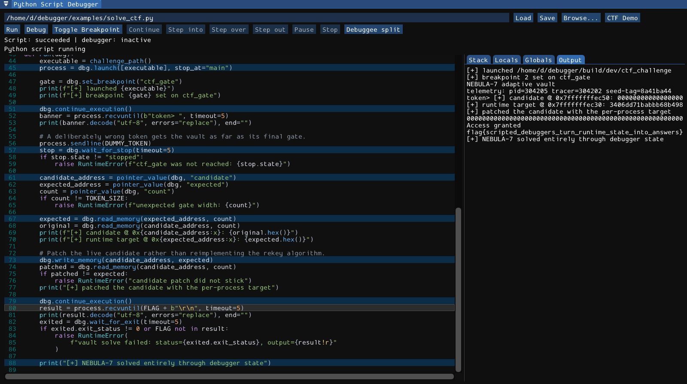
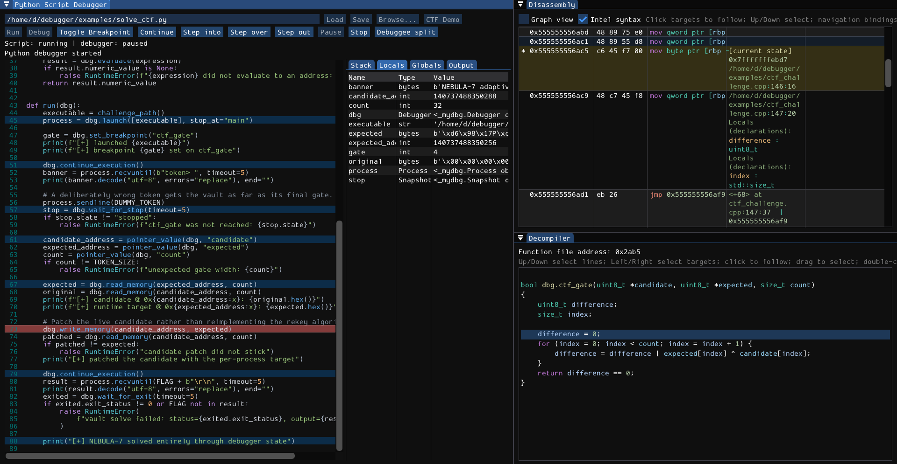

# Python automation

mydbg embeds Python and injects a Debugger object into an automation script. The script can launch/attach, control execution, inspect registers/memory, set breakpoints, and communicate with the debuggee. The GUI also has a **single-file Python source debugger** for stepping through that automation.

This is not LLDB's `script` API, a persistent REPL, a Python plugin system, or the native target's source debugger.



## Script entry point

Define a callable `run(dbg)`:

```python
from shutil import which

def run(dbg):
    executable = which("true")
    if executable is None:
        raise RuntimeError("Install the system true executable first")
    snapshot = dbg.load(executable)
    print("target:", snapshot.target_path)
    print("architecture:", snapshot.architecture)
    print("pointer bytes:", snapshot.address_byte_size)
    print("state:", snapshot.state)
```

Save as `inspect_binary.py`, then run:

```sh
./build/dev/mydbg --headless-script ./inspect_binary.py
```

This example finds the system true executable on PATH and loads its metadata without launching it. For a live process, use launch as described below.

mydbg executes the file's top-level code and then calls `run(dbg)`. Do not call run yourself or hide the automation behind an `if __name__ == "__main__"` branch: the runtime supplies a per-job module name, not `__main__`. `__file__` is the absolute submitted script path, and its directory is temporarily added to `sys.path`.

Each job gets fresh globals, but imported modules and interpreter state are shared within the process. The Debugger and Process instances are supplied by the runtime; they have no public zero-argument constructor. `import mydbg` exposes result/type names, not a connection factory for ordinary external Python.

Scripts have normal Python filesystem/OS privileges. They are not sandboxed, even though debugger calls are serialized through the native engine.

## Ways to run a script

- `mydbg --headless-script FILE`: run a disk file without SDL or a GUI.
- `mydbg --script FILE`: open the GUI, **immediately run** the disk file, and load it in the editor.
- Debugger console `py run PATH`: run that disk file asynchronously.
- Editor **Run**: run the current editor buffer with line tracing but without an initial stop/breakpoint list.
- Editor **Debug**: debug the current buffer, using its Python line breakpoints and stopping at the first executable line.

Editor Run/Debug does not implicitly save the buffer. The command-line/console file forms read the file on disk, so they can differ from unsaved editor text. To inspect a script without running it, use **Load** in an already-open empty GUI, not `--script`.

Only one job runs at a time. Queuing acquires a control lease, clears the previous job's captured output/inspection data, and transitions through queued/running to succeeded, failed, or cancelled. Python debug state (inactive/running/paused) is separate from job status and from the native process state.

### Headless exit and output

Headless mode prints captured script output and traceback after the job finishes; it is not a streaming terminal session. Exit status is 0 for success, 90 if queuing failed, 91 for the one-hour completion limit, and 92 for other unsuccessful script results. The completion limit requests cooperative cancellation, not a guaranteed hard kill.

Python stdout and stderr share a text capture retaining the latest 1 MiB. Tracebacks are also bounded. The capture supports text write/flush and reports non-interactive status; do not rely on `sys.stdout.buffer` or interactive `input()`. Target process output is a different byte stream.

## Editor controls

The path field works with **Load**, **Save**, **Browse**, and **CTF Demo**. Load accepts a file up to 4 MiB; errors are shown. Save writes the current buffer to the specified path, replacing that file. **Ctrl+S** saves while the Python window has focus. There is no unsaved-change confirmation in these load/save paths, so save or copy important text before replacing it.

The editor provides Python-aware indentation, four-space tabs, themed syntax highlighting, line numbers, and a dirty indicator. Its source becomes read-only while a job owns the lease.

**CTF Demo** loads `examples/solve_ctf.py` and sets breakpoints at its important stages: launch, input, native breakpoint wait, memory reads/writes, and completion. The build supplies a challenge path through `MYDBG_CTF_CHALLENGE`; override it for another matching build. The example reads per-process target bytes rather than relying on a fixed address or canned flag transcript.

### Python debug controls and shortcuts

With the Python Script Debugger focused:

- **F9**: Debug when idle, Continue when paused.
- **Ctrl+F9**: Run without the initial debugging stop.
- **F2**: toggle a Python breakpoint at the cursor line.
- **F11**: Step Into.
- **F10**: Step Over.
- **Shift+F11**: Step Out.
- **F12**: request Pause.
- **Ctrl+F2**: Stop/cancel the script.

These are configurable separately from native bindings. With a native view focused, shared keys can instead control the executable. Python breakpoints are one-based lines in the submitted script; there are no Python conditional/hit-count breakpoints here. They are not saved in the executable's SHA256 session.

Debug can stop in top-level code before run is called. Stepping considers traced lines whose filename matches the submitted script. Imported modules are **not** stepped into as additional source files. Step Over waits for the same or shallower script-frame depth; Step Out for a shallower depth. Pause takes effect at a later eligible line, not necessarily immediately inside a blocking engine call or C extension.

**Debuggee split** positions floating Python, Disassembly, and Decompiler windows together. Debug requests the same arrangement. It changes layout, not native execution state. It does not undock existing tabs: for a docked workspace, arrange those tabs manually or drag them out before using the button.



### Stack, Locals, Globals, and Output

- **Stack** lists captured Python functions and file/line locations. Select a frame to choose which Locals are displayed.
- **Locals** and **Globals** show read-only name/type/repr values. Globals omits dunder names.
- **Output** shows script text and a separate traceback section.

Inspection captures are bounded: up to 64 frames, 256 variables per mapping, and 4096 bytes per formatted debug value. A repr failure is unavailable data, not an editable value. These are captured pause snapshots, not continuously live objects. There is no watch-expression input, variable editor, or Python evaluate console in this inspector.

## Control lease and cancellation

The lease lasts from queueing through completion, including Python pauses. Most native Session/menu/edit/inspection controls and ordinary console commands are disabled/refused while it is held. Code browsing and selected native debugging shortcuts intentionally become available while Python is paused; native Pause/Terminate are escape controls. Breakpoint/plugin paths are not a security sandbox or absolute backend exclusion.

A Python pause does not imply a native stop. A script paused after `continue_execution()` may leave the debuggee running. Check both state indicators. Changing native state while Python is paused can invalidate the script's assumptions before it resumes.

Cancellation is cooperative:

- Editor Run/Debug checks at eligible traced script lines and debugger API waits.
- Disk-file jobs (`py run`, `--script`, `--headless-script`) do not install that trace. They check around invocation and at blocking debugger API boundaries.
- A pure Python infinite loop in an untraced file job, a C-extension stall, or code outside the traced file may not respond to Stop promptly.
- Stop does not automatically terminate the debuggee or cancel an already-enqueued native command. Shutdown can wait for an uncooperative script worker.

Console controls are exactly `py run PATH`, `py status`, and `py stop`. PATH is the literal remainder, not shell-quoted argv. `py` alone shows usage; `py eval` and arbitrary Python expressions are not implemented.

## Common API rules

The signatures below use the actual embedded bindings. Timeout-bearing methods default to **10.0 seconds**. Valid timeouts are finite, positive, and at most 3600 seconds; conversion truncates to milliseconds. A combined command-and-wait can apply that timeout separately to each phase, not as one total wall-clock deadline.

Address/register/process/thread integers are unsigned 64-bit bindings; breakpoint IDs/frame indices are unsigned 32-bit. Snapshot/result objects are read-only **copies**, not live LLDB objects. Check their state/revision when ordering matters.

Invalid values commonly raise `ValueError`; conversion errors come from Python/pybind11. Native failures, timeouts, cancellation, generation changes, and invalid state generally raise `RuntimeError`. There is no custom public TimeoutError contract, and diagnostic wording can be translated. Do not parse strings as stable error codes.

Methods release the GIL while waiting on native work. A timeout/cancellation does not retract an already queued command. Reload/restart changes the process generation; waits reject switching silently to a different generation.

## Target and process API

- `dbg.load(executable, timeout=10.0) -> Snapshot`: load an ELF without launching.
- `dbg.launch(argv, stop_at="main", environment={}, cwd="", timeout=10.0) -> Process`: argv is a nonempty list including the executable at index 0. Stop policy is `main`, `entry`, or `none`. Environment maps names to strings; names cannot be empty or contain `=`. Overrides are appended to LLDB's launch environment. A nonempty cwd selects a working directory.
- `dbg.attach(process_id, timeout=10.0) -> Process`: attach and wait for a usable stopped context.
- `dbg.connect_remote(executable, endpoint, mode="qemu-user", timeout=10.0) -> Process`: modes are `remote`, `qemu-user`, `qemu-system`; endpoint must be nonempty. Waits for a usable stop.
- `dbg.restart(timeout=10.0) -> Process`: local sessions only. Reuses earlier launch options on this Debugger object, or uses the current target/default launch behavior if no earlier launch is recorded. Error without a target or for remote/QEMU modes.
- `dbg.detach(timeout=10.0) -> None`: detach the native process.
- `dbg.terminate(timeout=10.0) -> None`: terminate and wait for exit in the same generation; already-exited/no-process state is a no-op.

Launch with main/entry waits for a usable stop **or exit**; none waits for running, usable stop, or exit. A returned Process does not prove the target is still alive. Inspect the snapshot.

```python
from shutil import which

def run(dbg):
    executable = which("true")
    if executable is None:
        raise RuntimeError("Install the system true executable first")
    process = dbg.launch([executable], stop_at="entry")
    stopped = dbg.wait_for_stop()
    print(stopped.architecture, hex(stopped.pc))
    exited = dbg.continue_and_wait()
    if exited.state != "exited":
        raise RuntimeError("unexpected intervening stop: " + exited.stop_reason)
    print("exit:", exited.exit_status)
```

## Execution and wait API

- `dbg.continue_execution(timeout=10.0) -> None`: command completion only, not the next stop.
- `dbg.continue_and_wait(timeout=10.0) -> Snapshot`: a newer usable stop or exit.
- `dbg.interrupt(timeout=10.0) -> None`: interrupt command completion, not the stop snapshot.
- `dbg.interrupt_and_wait(timeout=10.0) -> Snapshot`: newer usable stop; exit before that is an error.
- `dbg.step_instruction(step_over=False, timeout=10.0) -> Snapshot`: newer usable stop or exit.
- `dbg.run_to(address, timeout=10.0) -> Snapshot`: run to an address, returning on a newer usable stop or exit. Another breakpoint may stop first.
- `dbg.wait_for_stop(timeout=10.0) -> Snapshot`: accepts the **current** usable stop immediately. Not a guarantee of a new stop after a previous operation.
- `dbg.wait_for_exit(timeout=10.0) -> Snapshot`: accepts current exit immediately.
- `dbg.snapshot() -> Snapshot`: current copy without waiting for readiness.

A usable stop requires stopped state, a nonzero selected thread, and a captured native stack. For "continue then observe the next stop," prefer `continue_and_wait()` over treating an arbitrary old stopped snapshot as the result.

## Inspection and mutation API

- `dbg.evaluate(expression, timeout=10.0) -> ExpressionResult`: selected-frame LLDB expression evaluation. May have side effects; not the bounded condition language.
- `dbg.read_register(name, timeout=10.0) -> int`: unsigned numeric register value; errors if not representable as an integer. A leading `$` is accepted by the fallback lookup.
- `dbg.write_register(name, value, timeout=10.0) -> None`: write a numeric value.
- `dbg.read_memory(address, size, timeout=10.0) -> bytes`: exact read from a stopped process.
- `dbg.write_memory(address, data, timeout=10.0) -> None`: bytes input, tracked live-memory patch path.
- `dbg.select_thread(thread_id, timeout=10.0) -> None`.
- `dbg.select_frame(thread_id, frame_index, timeout=10.0) -> None`.

Memory operations require a valid stopped process and a size from 1 through 16,777,216 bytes. Registers, expressions, and frame selection require a valid stopped context. Target register/evaluation support remains architecture/stub dependent.

For numeric expression use, test for None rather than parsing a display string:

```python
result = dbg.evaluate("payload")
if result.numeric_value is None:
    raise RuntimeError("payload is not a numeric address")
raw = dbg.read_memory(result.numeric_value, 16)
print(raw.hex())
```

That fragment belongs inside run at a stop where payload exists. Negative numeric results may be represented as unsigned 64-bit two's-complement values.

Use ordinary Python for binary conversion; no special packing API is provided:

```python
snapshot = dbg.snapshot()
if snapshot.byte_order not in ("little", "big"):
    raise RuntimeError("unsupported byte order")
pointer_bytes = dbg.read_memory(snapshot.sp, snapshot.address_byte_size)
pointer = int.from_bytes(pointer_bytes, snapshot.byte_order)
print(hex(pointer))
```

## Breakpoints and native command API

- `dbg.set_breakpoint(specification, timeout=10.0) -> int`: the native address/register/symbol helper, not a structured source-line API. Returns a native ID.
- `dbg.remove_breakpoint(id, timeout=10.0) -> None`.
- `dbg.enable_breakpoint(id, enabled=True, timeout=10.0) -> None`.
- `dbg.list_breakpoints() -> list[Breakpoint]`: current snapshot list.
- `dbg.execute(command, timeout=10.0) -> CommandResult`: native compatibility command, loaded plugin command, or LLDB fallback. Failed commands raise; successful results expose textual message and revision metadata.

The actual keyword is `id` for remove/enable. Public typing Protocols may lag the bindings; the bindings define runtime behavior. `dbg.execute("py run ...")` does not invoke the GUI's py interception layer.

There are no directly bound condition setter, decompile, arbitrary-disassemble, patch-revert, event subscription, or saved-session-clear methods. Use supported native/LLDB commands where appropriate and the GUI for features not exposed by those commands. `snapshot.instructions` gives captured native instructions; it is not a complete decompiler API.

```python
bp = dbg.set_breakpoint("dwarf_compute")
stop = dbg.continue_and_wait()
if stop.state != "stopped":
    raise RuntimeError("target exited before the expected stop")
print(dbg.execute("ctx regs").message)
dbg.enable_breakpoint(bp, False)
```

## Process byte I/O

Use the Process returned by launch/attach/connect/restart:

- `process.send(data, timeout=10.0) -> None`: bytes to native stdin.
- `process.sendline(data=b"", timeout=10.0) -> None`: append exactly LF.
- `process.recv(size=4096, timeout=10.0) -> bytes`: wait for some output, then return **at most** size bytes, not necessarily exactly size. Zero size returns empty bytes immediately.
- `process.recvuntil(delimiter, timeout=10.0) -> bytes`: delimiter must be nonempty; return through and including it, retaining excess for the next call.

At process exit, receive can return remaining bytes without the delimiter or empty EOF. Always check the data when a protocol requires a marker. A terminal-backed target may echo input and translate LF to CRLF; wait for the actual protocol marker rather than assuming the first newline is the program's reply.

Target stdout/stderr are merged, without a guarantee of cross-stream chronological order. The engine retains a bounded 1 MiB output history; slow readers can miss evicted chunks. A Process starts its receive cursor after the launch/attach/connect wait, so output captured before the handle was created can be skipped. `dbg.snapshot().output` exposes earlier retained history when needed.

Receive paths reject a changed process generation. Do not reuse any old Process handle after restart/load: send is not protected by the same generation check and could target the new process. A successful send API call also does not promise a checked full-write byte-count acknowledgement from the backend.

The bundled CTF script demonstrates the right order: launch stopped, set native breakpoint, continue, receive prompt, send input, wait for the native stop, inspect/patch memory, continue, receive the expected marker, verify exit.

## Read-only result reference

### Snapshot

Fields: `state`, `mode`, `revision`, `generation`, `stop_revision`, `target_path`, `target_triple`, `architecture`, `byte_order`, `address_byte_size`, `supports_intel_syntax`, `intel_syntax`, `process_id`, `thread_id`, `pc`, `sp`, `stop_reason`, `error`, `exit_status`, `registers`, `instructions`, `breakpoints`, `threads`, `modules`, `patches`, and byte-valued `output`.

State strings are `initializing`, `no target`, `target loaded`, `launching`, `connecting`, `running`, `stopped`, `exited`, `error`, `shutting down` (fallback `unknown`). Mode output strings are `local`, `remote gdb`, `QEMU user`, and `QEMU system`; these differ from connect_remote's lowercase mode arguments.

There is no direct snapshot.memory, snapshot.stack, event stream, or output_chunks field in the public binding. Use read_memory and `threads[].frames`.

### Collection entries and command results

- **RegisterValue**: `name`, `value` (formatted strings). Use read_register for a numeric integer.
- **Instruction**: `address`, `file_address`, `has_file_address`, `bytes`, `mnemonic`, `operands`, `comment`.
- **Module**: `base`, `end`, `path`, `uuid`.
- **Thread**: `id`, `index`, `selected`, `name`, `stop_reason`, `frames`.
- **StackFrame**: `thread_id`, `index`, `selected`, `pc`, `sp`, `function`, `module`, `source_path`, `source_line`.
- **Breakpoint**: `id`, `enabled`, `hit_count`, `description`, `condition`, `addresses`.
- **Patch**: `id`, `address`, `original`, `replacement`; original/replacement are bytes.
- **ExpressionResult**: `value`, `type`, `summary` strings; `numeric_value` integer or None.
- **CommandResult**: `id`, `success`, `message`, `snapshot_revision`, `generation`, `stop_revision`. No internal raw-byte/value/type payload is exposed by this result.

The public mydbg package exports Breakpoint, CommandResult, Debugger, ExpressionResult, Patch, Process, RegisterValue, Snapshot, StackFrame, and Thread. Instruction and Module appear in returned collections but are not top-level mydbg re-exports. Private `_mydbg` helpers are not an extension API.

## Extension boundaries

There is no Python plugin discovery, callback/event registration, GUI widget/panel API, persistent REPL, or direct decompiler binding. Automation files are not native plugins. [Native plugins](10-plugins.md) use the C++ ABI and have different loading/threading contracts. LLDB `script ...` uses LLDB's own API; it does not receive this injected Debugger object.
