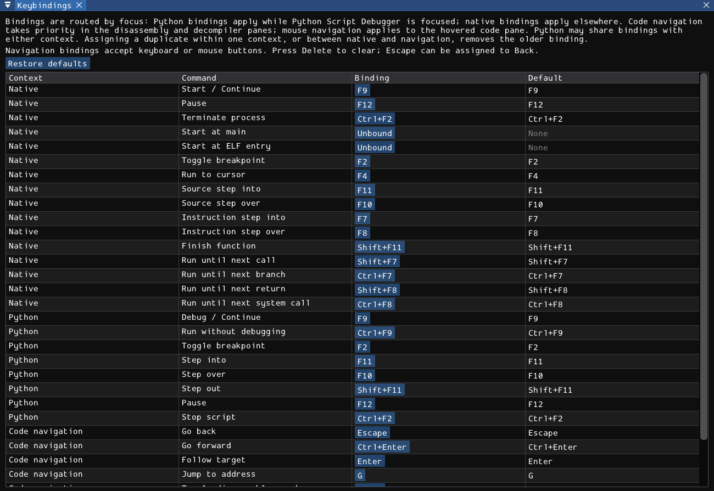
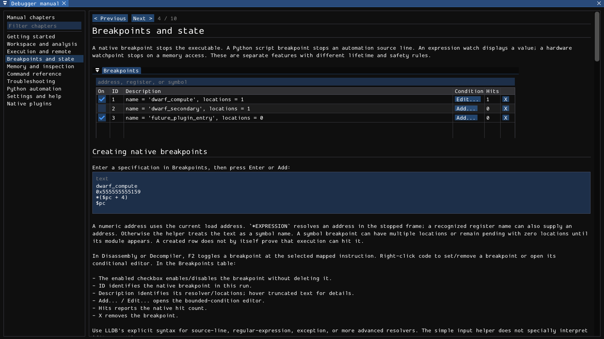

# Settings and help

Settings are global to this copy of the GUI, not to the executable being debugged. Binary-specific breakpoints and annotations live in a separate [saved session](04-breakpoints.md).



## Docking and window layout

Drag a panel's title or tab to move it. Drop onto a docking indicator to split a region or add a tab. Drag dividers to resize adjacent regions. Tabbed panels remain active; selecting a tab changes what is visible, not the selected thread or process state.

The always-present panels are Session, Breakpoints, Disassembly, Decompiler, Command, Registers, Memory dump, and Python Script Debugger. **View** toggles Threads, Backtrace, Stack telescope, Memory map, Modules, ELF security, glibc heap, and Scans. Closing an optional panel is equivalent to hiding it; reopen it from View.

The Python debugger's **Debuggee split** button positions floating code and script windows together. Existing docked tabs are not automatically undocked; arrange them manually or drag them out first. This changes the workspace, not the running script or its breakpoints.

### Where preferences are stored

The GUI reads and writes **mydbg.ini beside the executable**, not the shell's working directory and not the XDG session directory. The bottom of the Settings menu displays the actual filename. This file contains ImGui docking/window/table state and a `[MyDbg][Settings]` section with:

- Theme, user scale, and selected font identifier.
- Visibility of optional panels and the disassembly graph preference.
- Window position, size, and maximized state.
- Native, Python, and navigation keybindings.

Changes are marked for automatic saving; orderly shutdown also writes the file. The executable directory must be writable for preferences to survive. A read-only application directory does not prevent debugging, but is unsuitable for saving GUI preferences.

If no local mydbg.ini exists, the application loads the `mydbg_default.ini` baseline compiled into the binary. Editing that repository file affects future builds, not an already-running application's saved preferences.

To reset the layout and all GUI preferences, close mydbg and move its adjacent mydbg.ini to a backup filename. Start again to use the compiled baseline. Do not do this while another instance is using that file: its later save can overwrite the reset. **Clear saved session** does not reset the layout, theme, or bindings.

## Theme

**Settings > Theme > Dark / Light** changes widget colors and the debugger's analysis colors. The Python editor palette follows the theme. The native console also accepts:

```text
theme dark
theme light
```

Theme selection is a display preference, not a transformation of target bytes or debug information.

## Display scale and fonts

**Settings > UI scale** offers 75%, 100%, 125%, 150%, 175%, 200%, 250%, and 300%. The application combines the user factor with SDL's display scale; the menu shows display and effective scale. Fonts and widget spacing scale together.

Set an initial override before launch:

```sh
MYDBG_UI_SCALE=1.25 ./build/dev/mydbg
```

The environment value overrides the saved user factor at startup. Finite values are clamped to 0.75-4.0. Invalid text emits a diagnostic and uses 1.0. It does not override the desktop's display scale. Menu changes remain possible after startup and are saved normally.

**Settings > Font** always offers the embedded vector font. System monospace and sans-serif choices appear only when a font can actually be loaded from the application's known platform paths. On Linux those include DejaVu, Noto, and Liberation locations under `/usr/share/fonts`. A missing saved font falls back to the embedded font. There is no arbitrary font-file picker and no guarantee that a font installed elsewhere appears in the menu.

## Changing keyboard and mouse bindings

Open **Settings > Keybindings**. Each row shows the context, command, current binding, and factory default.

1. Click the current binding button.
2. Press the desired key, optionally with Ctrl, Shift, Alt, or Super.
3. For a navigation action, you may also click a mouse button, including Back/Forward side buttons.

A modifier alone is not a binding. Native and Python rows accept keyboard keys, not mouse buttons.

- **Escape clears** a native or Python binding during capture.
- **Delete clears** a navigation binding during capture. Escape is deliberately bindable there because it is the default Back action.
- **Restore defaults** resets all three contexts, including navigation, in one click.
- Assigning a duplicate clears the previous conflicting assignment and displays a message. Native actions and navigation share collision checks; Python bindings are independent because they use another focus context.

The application saves encoded ImGui key chords under `Keybinding.*`, `PythonKeybinding.*`, and `NavigationKeybinding.*`. Use the editor rather than hand-authoring version-sensitive integer values. Zero means unbound.

### Which context receives a shortcut?

When the Python Script Debugger has focus, its debug controls take precedence. Otherwise native controls apply. Navigation shortcuts require focus in Disassembly or Decompiler, a stopped target, and no active control lease. A text field, modal editor, or binding capture can consume keys instead of the debugger.

Native and Python both use F9, F2, F10, and F11 by default, but they operate on different things. F2 in the Python editor toggles a **Python source-line breakpoint**, not an executable breakpoint. See [execution](03-execution.md) for native defaults and [Python automation](08-python-automation.md) for script defaults.

The code-navigation defaults are Escape (Back), Ctrl+Enter (Forward), Enter (Follow), G (jump to an address/expression), Space (linear/graph), Tab (Disassembly/Decompiler), and mouse side buttons (Back/Forward). These are configurable. F1 opens help independently of that table; text entry can consume it.

## Translation catalogs

English runtime text is embedded from `locales/en/*.ini`. Normal startup does not require those files. To load a translation or partial override, set `MYDBG_TRANSLATION` to a UTF-8 INI file or a directory:

```sh
MYDBG_TRANSLATION=/path/to/fr.ini ./build/dev/mydbg
MYDBG_TRANSLATION=/path/to/fr ./build/dev/mydbg --headless-script script.py
```

Catalogs load once per process. Restart to change languages. A directory loads immediate `.ini` files in filename order. Missing keys retain English; duplicate keys across files are errors, not last-file-wins overrides.

Values use JSON-quoted strings. Match the key's section in the English catalog:

```ini
[labels]
WindowSession = "Séance"
GuiPanelsLaunchRestart = "Relancer"

[strings]
GuiPanelsContinue = "Continuer"

[formats]
GuiPanelsState = "État : %s"
```

- `[labels]` contains widget labels. Stable hidden ImGui identities are added automatically; do not add `##` or `###` yourself. Changing the visible language preserves the window identity and layout.
- `[strings]` contains ordinary text.
- `[formats]` contains checked printf-style formats. Preserve argument types, including width/precision arguments and portable integer tokens such as `%@PRIx64@`.
- Positional forms such as `%2$s: %1$s` can reorder arguments; if used, all arguments must be positional.
- Use `%%` for a literal percent in a format, but ordinary `%` in labels/strings.
- JSON escapes include `\n`, `\"`, and `\u00e9`. NUL-separated choice lists use `\u0000`; preserve the option count, separators, and terminator.

Invalid catalogs are rejected as a unit with a diagnostic and English fallback. Command keywords, register names, Python API/status tokens, configuration keys, and protocol fields are stable identifiers, not translated commands. Target output and third-party LLDB/Rizin diagnostics are not rewritten. The manual itself is separate Markdown and is not translated by the INI mechanism.

## Built-in manual

Press **F1** outside text entry or choose **Help > Debugger manual**. **Help > Conditional breakpoints** opens the breakpoint chapter directly.



The left pane lists chapters. Its filter searches chapter titles **and full chapter text**, case-insensitively; it filters chapters rather than highlighting individual matches. Select a chapter or use **Previous / Next**. Relative chapter links switch chapters; a heading fragment does not scroll to an exact heading. HTTP(S) links open through the desktop's URL handler.

Code examples have their own scrollable region. Screenshots scale down to the available width without changing aspect ratio. Widen the manual or read the original PNG to inspect fine details.

### Shipping or updating the manual

Chapter text is embedded at build time from `docs/manual/*.md`. Screenshots are PNG files under `docs/manual/screenshots/`. Building mydbg refreshes the `manual/` directory beside the binary even if only an image changed. This is a generated mirror: edits belong in the source directory, not in the replaced build copy. When moving a build, keep that directory beside the executable; text remains available without it, but screenshots do not.

The reader checks the source asset directory first and then the executable-adjacent manual directory. Screenshot paths must be relative and cannot contain `..`. PNGs are bounded to 4096 by 4096 pixels. Restart after replacing an image that was already loaded: successful and failed texture lookups are cached for the life of the process.
