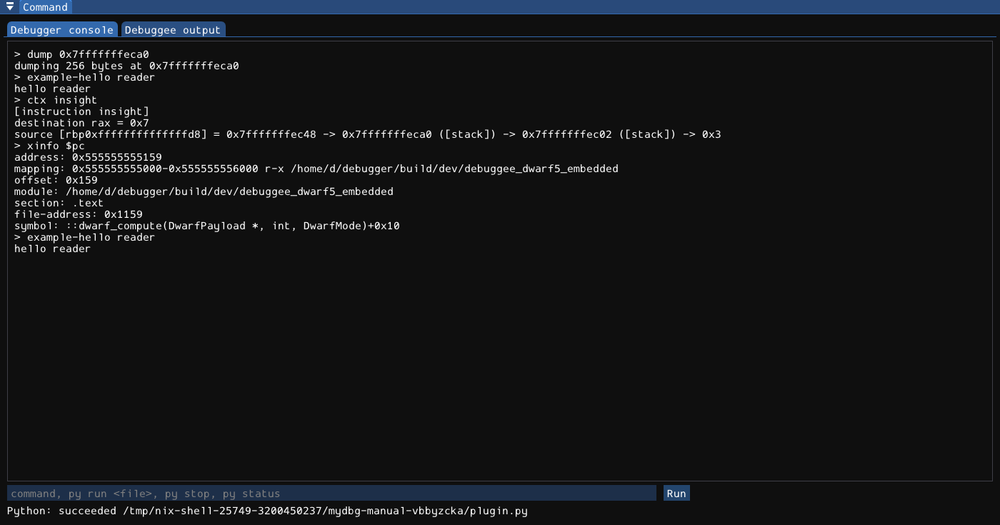

# Native plugins

mydbg supports trusted, in-process **C++ shared-object plugins**. They can register native console commands, receive debugger lifecycle/snapshot events, and draw GUI surfaces. Automation scripts are not plugins: there is no Python plugin discovery, event-subscription, or widget API.



## Loading plugins

At GUI startup, the loader searches these directories in order:

1. `plugins` relative to the current working directory.
2. Each nonempty colon-separated directory in `MYDBG_PLUGIN_PATH`.
3. `$XDG_CONFIG_HOME/mydbg/plugins` when XDG_CONFIG_HOME is set, otherwise `$HOME/.config/mydbg/plugins` when HOME exists.

Within each directory, regular files ending in `.so` are sorted by filename and loaded nonrecursively. Missing/non-directory paths are skipped. Loader errors go to stderr. The environment variable accepts **directories**, not a direct plugin filename.

```sh
MYDBG_PLUGIN_PATH=/absolute/path/to/trusted-plugins ./build/dev/mydbg
```

The GUI `--script` form uses the same startup loading. The developer `--headless` vertical-slice runner also loads plugins, but ordinary **`--headless-script` does not**. Do not assume a plugin command available in the GUI exists in a headless automation job.

There is no directory deduplication, enable/disable manager, hot reload, or unload command. Avoid listing the same plugin through multiple paths. Restart the application to load a changed build; merely replacing a .so does not update callbacks already registered in memory.

## Trust and ABI

A plugin executes native code with the debugger's permissions and can crash or compromise the application/target. No sandbox, signing, permission prompt, or crash isolation is supplied. Use a dedicated trusted directory rather than one writable by untrusted users.

The required exported entry point is:

```cpp
extern "C" bool mydbg_plugin_init(
    debugger::plugins::PluginRegistry *registry,
    std::uint32_t abi_version);
```

The current ABI constant is `debugger::plugins::plugin_abi_version`, version **2**. Validate the pointer and version before registering anything. The C-exported initializer leads to C++ std::function/std::string/native-engine interfaces; this is **not** a stable language-neutral C ABI. Build against matching project headers and a compatible C++ toolchain/runtime.

The loader uses `dlopen` with immediate local resolution and looks up that exact symbol. A missing entry point is rejected. Returning false or throwing reports initialization failure, but already performed registrations are not rolled back. Validate prerequisites before publishing callbacks.

Successful and initialized-but-rejected handles can remain resident for process lifetime. There is no plugin finalizer, unregister, unsubscribe, or guaranteed unload cleanup. Do not design resource ownership around a later unload callback that does not exist.

## A minimal command plugin

This example reports a greeting and does not modify target state:

```cpp
#include "plugins/PluginApi.h"
#include <string>

extern "C" bool mydbg_plugin_init(
    debugger::plugins::PluginRegistry *host,
    std::uint32_t abi) {
    if (!host || abi != debugger::plugins::plugin_abi_version)
        return false;
    return host->register_command(
        "example-hello", "Return a greeting without changing the target",
        [](std::string_view args, const debugger::SessionSnapshot &) {
            return std::string("hello ") + std::string(args);
        });
}
```

Save as `example_plugin.cpp`. A small CMake project can build it with the same toolchain as mydbg:

```cmake
cmake_minimum_required(VERSION 3.28)
project(example_plugin LANGUAGES CXX)
add_library(example_plugin MODULE example_plugin.cpp)
target_compile_features(example_plugin PRIVATE cxx_std_20)
target_include_directories(example_plugin PRIVATE /absolute/path/to/mydbg/src)
set_target_properties(example_plugin PROPERTIES PREFIX "")
```

Replace the include path. Build outside an automatically loaded directory, then place the trusted resulting .so in the chosen plugin directory and start mydbg with MYDBG_PLUGIN_PATH pointing there. The host executable exports registry symbols for module resolution. For GUI code you also need matching ImGui headers/build settings; the plugin header is not a separately installed GUI SDK.

Enter this in **Debugger console**, not `py run`:

```text
example-hello reader
```

The callback's returned text appears as command output. The repository's `tests/plugins/test_plugin.cpp` demonstrates the same ABI-checked registration pattern.

## Command registration

```cpp
bool register_command(std::string name,
                      std::string help,
                      CommandCallback callback);
```

The callback type is:

```cpp
std::function<std::string(std::string_view arguments,
                          const debugger::SessionSnapshot &snapshot)>
```

A name must be nonempty ASCII with every byte greater than space and less than DEL: no whitespace, control bytes, or non-ASCII. A callback must be nonempty. Command names are unique by exact spelling; invalid/duplicate registration returns false. Register lowercase names: the console dispatcher lowercases the command token before lookup.

Built-in mydbg command branches take precedence. Plugins are tried before unknown-command LLDB forwarding. Use a unique prefix to avoid built-in and LLDB names; registration does not guarantee your name overrides a built-in.

The callback receives the argument tail and a read-only native snapshot, not an engine reference. Return text for the command result/console. The registry contains command-callback exceptions and marks the command failed with a diagnostic. The help string is registration metadata; do not assume every plugin receives a generated GUI help page or automatic built-in help entry.

Commands run on the engine's command path, not the GUI thread. Keep callbacks short and do not synchronously wait for more work that requires that same engine worker.

## Event subscriptions

```cpp
void subscribe(EventCallback callback);
```

Callback type:

```cpp
std::function<void(debugger::plugins::Event,
                   const debugger::SessionSnapshot &)>
```

An empty callback is ignored. There is no filter argument, token, unsubscribe, or duplicate suppression. Filter the event inside the callback if needed.

Implemented events:

- **TargetLoaded**: a nonempty published target path changes. Reloading the same path does not necessarily emit it.
- **ProcessStarted**: a nonzero process ID changes or the process generation changes.
- **ProcessStopped**: the process becomes stopped or publishes a different stop revision.
- **ProcessContinued**: the state becomes running.
- **ProcessExited**: the state becomes exited.
- **SnapshotUpdated**: every published snapshot, after the applicable lifecycle notifications.
- **ThreadSelected** and **FrameSelected**: successful explicit engine selection paths, before the subsequent publication. These are not blanket notifications for every LLDB-internal selection change.

There are no TargetUnloaded, ProcessDetached, or plugin-unload events in this API. Treat generation and revision fields as authoritative context rather than inferring a perfect event log from paths alone.

Subscribers are copied under the registry lock and invoked outside it, synchronously on the dispatching engine path. Exceptions in an event callback are swallowed so delivery can continue; log your own diagnostic if needed. Copy data you retain beyond the call, synchronize cross-thread state, and never hold a callback waiting for a command that cannot run until the callback returns.

## GUI surfaces

```cpp
bool register_surface(std::string name,
                      debugger::plugins::Surface surface,
                      RenderCallback callback);
```

Callback type:

```cpp
std::function<void(const debugger::SessionSnapshot &,
                   debugger::LldbEngine &)>
```

Surface enum values are **DockPanel**, **Sidebar**, **Widget**, and **Menu**. Names use the same ASCII/nonempty rule; uniqueness is by `(name, surface)`, so a name can appear in different surface kinds.

All non-Menu kinds currently share one rendering call site, once per GUI frame. They do **not** automatically create distinct sidebar/widget containers or a named dock for you. Own the ImGui Begin/End calls, layout, and drawing appropriate to the surface.

Menu callbacks run inside the **Plugins** menu when it is open. The host shows that menu only when a Menu surface is registered. No GUI callbacks run in headless mode.

Rendering runs on the GUI thread and receives an engine reference for queued operations. It must not block the UI. Unlike command/event dispatch, the render call site does not catch exceptions; contain your own failures and always balance ImGui calls.

During a Python control lease, non-Menu callbacks are drawn within a disabled-widget scope, but the callback still executes and can call the engine. This is a UI affordance, not a plugin permission boundary. Menu callbacks and direct engine access require the plugin author to respect application state deliberately.

## Registry inspection and ownership

`commands()` and `surfaces()` return copies of registrations. Registry command execution returns an optional result for recognized names and reports callback failure separately. Registration data is retained by the singleton registry, so captured callback resources must remain valid for application lifetime.

Command/event code can run on the engine thread while rendering runs on the GUI thread. Protect shared plugin state and avoid retaining references to transient snapshots. mydbg plugins are also distinct from LLDB backend plugins and Rizin/rz-ghidra analysis providers; replacing one category does not register another category's commands or UI.
